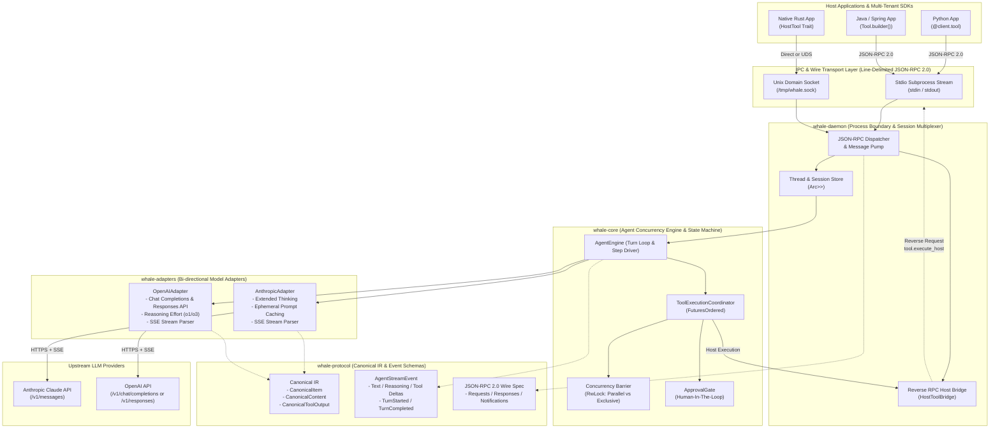

# Whale AI SDK 核心架构设计与系统全景规范

## 1. 架构全景图 (High-Level Architecture)

Whale AI SDK 采用**分层解耦、守护进程解耦 (Daemon-Process Separation)、薄客户端 (Thin Client) 与反向调用 (Reverse RPC)** 的工业级分布式 Agent 架构。系统整体划分为底层协议规范、模型适配层、Agent 调度引擎内核、进程间通信守护进程以及多语言薄客户端 SDK。



---

## 2. 核心设计哲学 (Core Design Philosophy)

### 2.1 统一中间表示 (Canonical IR - Intermediate Representation)
在大语言模型领域，各个厂商（OpenAI、Anthropic、Google Gemini、DeepSeek 等）的请求格式、上下文消息结构以及流式 SSE 协议差异巨大：
- **Anthropic Claude**: 强调严格的 `user` / `assistant` 角色交替；支持 `extended thinking`（包含 `thinking` 块和签名 `signature`）；支持分级提示词缓存标记 `cache_control: { "type": "ephemeral" }`；
- **OpenAI**: 区分 `developer` / `system` / `user` / `assistant` / `tool` 角色；在 `o1`/`o3` 系列中引入 `reasoning_effort` 与 `reasoning_content`；支持传统 `Chat Completions API` 以及全新的面向智能体状态的 `Responses API`。

Whale 确立了 **Canonical IR** 原则：**内核态状态机与多语言 SDK 仅感知 Canonical 规范，绝不直接依赖任何单一厂商的 Wire 格式**。所有上下文和交互均表示为强类型的 `CanonicalItem`（UserMessage、AssistantMessage、Reasoning、ToolCall、ToolResult）。模型适配层（`whale-adapters`）负责在运行时完成 Canonical IR 与具体厂商传输格式的双向编译与无损流式反序列化。

### 2.2 飞行中 Future 调度与保序执行 (In-flight Future & FuturesOrdered)
在大模型驱动工具执行时，通常模型会单步吐出多个平行的工具调用（Tool Calls）。
- 如果单纯使用 `futures::join_all` 或 `tokio::spawn` 乱序执行，无法满足工具流执行日志与上下文回填的严格先后顺序，且并发竞争容易破坏外部系统的事务性。
- Whale 在 `ToolExecutionCoordinator` 中引入 **`futures::stream::FuturesOrdered`**，确保：
  1. 所有派发的工具异步 Future 在 Tokio 运行时后台并发驱动；
  2. 产生结果（Result Stream）的收集严格保序，与模型调用意图严格对齐；
  3. 每一个工具的执行状态流与完成事件能够确定性地推送到客户端。

### 2.3 双向反向工具调用 (Reverse Tool RPC)
主流 Agent 框架往往强迫工具必须用 Rust 编写并编译进核心二进制，或者强迫宿主应用实现臃肿的 HTTP Server。Whale 独创了 **双向全双工 JSON-RPC 2.0 (Reverse RPC)**：
- **Client -> Daemon**: 客户端发送常规 RPC 请求（例如 `session.start_thread`, `thread.run_turn`）；
- **Daemon -> Client**: 当 LLM 触发由宿主语言（Python, Java, Rust）声明的工具时，`whale-daemon` 通过既有的双向 IPC 通道直接向客户端发起反向 RPC 请求 `tool.execute_host`；
- **Client -> Daemon**: 客户端在本地线程池或事件循环中运行原生的 Python 函数或 Java 方法，并将结果封装为 `tool.execute_host_result` 答复守护进程。
该机制使得客户端无需暴露任何网络端口，宿主语言能够零摩擦地提供本地业务逻辑、内存数据库操作及系统集成能力。

### 2.4 多租户与多语言互操作性 (Multi-Tenant Language Interoperability)
为了让 Python、Java、Node.js 等多种语言生态无缝复用 Rust 极致的性能与并发调度能力，Whale 规避了脆弱且难以维护的 C-FFI / JNI 复杂内存管理，而是采用 **无状态轻量客户端 + 守护进程 (Subprocess / Unix Socket)** 架构：
- 跨语言边界通过标准换行符分隔的 JSON-RPC 2.0（Newline-delimited JSON）进行通信；
- 各语言 SDK 仅为“薄客户端”（Thin Client），代码量极小、依赖纯粹（Python 仅依赖标准库或基础工具，Java 仅依赖 Jackson）；
- 核心状态、KV 缓存优化、重试、SSE 粘包拆包与并发屏障全量固化在 `whale-daemon` 中，实现跨语言行为的一致性与超高吞吐。

---

## 3. 详细子系统技术剖析 (Subsystem Analysis)

### 3.1 协议中枢：`whale-protocol`

`whale-protocol` 是整个 Whale 架构的基础数据契约，严格实现 `no-panic`、强类型与全量 `serde` 序列化。

#### 3.1.1 CanonicalItem 与上下文语义模型
`CanonicalItem` 统一了所有大模型的会话状态项：
```rust
#[derive(Debug, Clone, PartialEq, Serialize, Deserialize)]
#[serde(tag = "type", rename_all = "snake_case")]
pub enum CanonicalItem {
    UserMessage {
        id: ItemId,
        content: Vec<CanonicalContent>,
    },
    AssistantMessage {
        id: ItemId,
        content: Vec<CanonicalContent>,
        phase: MessagePhase, // Commentary vs FinalAnswer
    },
    Reasoning {
        id: ItemId,
        thinking: String,
        signature: Option<String>,
        encrypted_content: Option<String>,
    },
    ToolCall {
        id: ItemId,
        call_id: String,
        namespace: Option<String>,
        name: String,
        arguments: Option<serde_json::Value>,
        raw_arguments: String,
    },
    ToolResult {
        id: ItemId,
        call_id: String,
        output: CanonicalToolOutput,
        is_error: bool,
    },
}
```
- **多阶段输出支持 (`MessagePhase`)**: 区分推理思考型模型在输出最终答案前产生的过渡性过程注释（`Commentary`）与最终结果（`FinalAnswer`）。
- **多模态与结构化输出**: `CanonicalContent` 原生支持文本、Base64 图片/音频及 URI 引用；`CanonicalToolOutput` 支持纯文本、结构化 JSON 以及图文复合 Blocks。

#### 3.1.2 实时流式事件 `AgentStreamEvent`
为了实现前端打字机效果、思维链动画以及工具进度追踪，内核定义了完整的细粒度事件流：
- `TurnStarted` / `TurnCompleted` / `TurnFailed`: 轮次生命周期与 Token 计费汇总；
- `ItemStarted` / `ItemCompleted`: 上下文项生命周期；
- `TextDelta`: 模型文本增量吐字；
- `ReasoningDelta` / `ReasoningSignature`: 思维链实时流与防篡改签名验证；
- `ToolCallDelta`: 工具调用参数分片流式拼接；
- `ApprovalRequested`: 人工介入（HITL）审批挂起通知。

#### 3.1.3 JSON-RPC 2.0 规范实现
严格遵循 [JSON-RPC 2.0 RFC](https://www.jsonrpc.org/specification)，提供类型安全的 `JSONRPCRequest`, `JSONRPCResponse`, `JSONRPCNotification` 以及带标准错误码（-32700, -32600, -32601, -32602, -32603）的 `JSONRPCError`。

---

### 3.2 双模型协议适配层：`whale-adapters`

`whale-adapters` 负责消除异构 LLM 供应商在网络协议和消息序列化上的壁垒。核心抽象为 `ProtocolAdapter` Trait：
```rust
pub trait ProtocolAdapter: Send + Sync {
    fn provider_name(&self) -> &'static str;
    fn endpoint_url(&self) -> String;
    fn serialize_request(
        &self,
        system_prompt: Option<&str>,
        history: &[CanonicalItem],
        tools: &[ToolDefinition],
        options: &SamplingOptions,
    ) -> Result<(serde_json::Value, HeaderMap), AdapterError>;
    fn parse_stream(&self, byte_stream: Pin<Box<dyn Stream<Item = Result<Bytes, reqwest::Error>> + Send>>) -> BoxedEventStream;
}
```

#### 3.2.1 Anthropic 适配器关键机制
1. **交替角色折叠 (Role Alternation Enforcement)**: Anthropic 要求 `messages` 数组中 `user` 与 `assistant` 严格交替。当多个 `ToolResult`（归属 user 角色）或连续思考消息产生时，适配器将其自动规约并合并为单个角色对象下的复合 `content` 数组。
2. **Extended Thinking**:
   - 当检测到 `thinking_budget` 参数时，注入 `thinking: { "type": "enabled", "budget_tokens": N }`；
   - 解析 SSE 事件流中的 `thinking_delta` 和 `signature_delta`，将加密验证签名无缝转入 `CanonicalItem::Reasoning`。
3. **Ephemeral Prompt Caching**:
   - 自动在请求头注入 `anthropic-beta: prompt-caching-2024-07-25`；
   - 在静态 System Prompt 末尾与长会话历史的关键截断点（如最近的工具结果块）自动注入 `cache_control: { "type": "ephemeral" }`，将多轮交互的输入 Token 成本降低高达 90%，首字延迟降低 85% 以上；
   - 从 `message_start` 及 `message_delta` 中精确提取 `cache_creation_input_tokens` 与 `cache_read_input_tokens`。

#### 3.2.2 OpenAI 适配器关键机制
1. **双重协议支持 (`Chat Completions` vs `Responses API`)**:
   - **Chat API**: 映射 `system`/`developer` 提示词，将 `ToolCall` 格式化为 `tools` 与 `tool_calls` 结构；支持 `o1`/`o3` 的 `reasoning_effort`（low, medium, high）；
   - **Responses API**: 支持 OpenAI 下一代面向智能体的输入规范，格式化为 `instructions` 与 `input` 序列（包含 `function_call` 与 `function_call_output`）。
2. **流式参数重组 (Streaming Argument Accumulator)**:
   - 追踪 SSE `choices[0].delta.tool_calls` 中的 `index` 与参数碎片，在流到达 `finish_reason: "tool_calls"` 时组装出合法的 JSON 对象并派发 `AgentStreamEvent::ItemCompleted`。

---

### 3.3 核心调度引擎：`whale-core`

`whale-core` 是整个系统的控制面核心，负责调度上下文演进、并发冲突规避与人类在环确认。

#### 3.3.1 Actor 调度循环与轮次驱动 (Turn Loop)
`AgentEngine::run_turn` 实现了确定性收敛的单轮 Agent 循环：
```
[User Input] 
     │
     ▼
[Step 0: Push UserMessage]
     │
 ┌───┴─────────────────────────────────────────────┐
 │ Turn Loop (for step in 0..max_steps):           │
 │   1. serialize_request(&session_history)        │
 │   2. HTTP POST & Consume SSE Byte Stream        │
 │   3. Emit Real-time Deltas to event_tx          │
 │   4. Finalize completed items                   │
 │   5. Check for ToolCall items:                  │
 │      ├── No ToolCalls -> Turn Completed! ───────┼──► [Exit Loop]
 │      └── Has ToolCalls -> Coordinator Dispatch  │
 │            ├── Parallel / Exclusive Barrier     │
 │            ├── Approval Gate Check (HITL)       │
 │            ├── Execute & Append ToolResult      │
 │            └── Next Step (LLM reads results) ───┘
 └─────────────────────────────────────────────────┘
```

#### 3.3.2 读写并发屏障与确定性执行 (Parallel Barrier RwLock)
工具并非都可以肆意并行。例如只读检索工具（`web_search`、`calculator`）并发调用是安全的；但文件写入、数据库表修改、代码编译等排他性工具（Mutating Tools）并发调用会导致脏写或文件死锁。
- Whale 在 `ToolHandler` Trait 中声明 `supports_parallel() -> bool`。
- 在 `ToolExecutionCoordinator` 中维护 `parallel_barrier: Arc<tokio::sync::RwLock<()>>`：
  - **并行安全工具**: 获取读锁 `barrier.read().await`，多个只读工具可无阻碍同时执行；
  - **排他性工具**: 获取写锁 `barrier.write().await`，强制等待正在运行的并发工具完全排空，并在独占期间阻塞后续工具，彻底杜绝数据竞态。

#### 3.3.3 人类在环审批网关 (ApprovalGate HITL)
对于敏感操作（如删除数据库、资金转账、执行系统高危命令），工具配置 `require_approval() -> bool = true`。
- 执行器检测到敏感工具调用时，调用 `ApprovalGate::request_approval`：
  1. 生成唯一全局 `request_id`；
  2. 注册内部 `tokio::sync::oneshot::channel`；
  3. 产生 `AgentStreamEvent::ApprovalRequested` 广播至客户端；
  4. 阻塞挂起当前工具的 Future 链路，**但不会阻塞 Tokio 运行时整体的事件调度**。
- 客户端通过调用 `approval.resolve`，提交仲裁决策：
  - `Accept`: 立即唤醒并按原参数放行执行；
  - `ModifyArguments`: 允许人类管理员修正 LLM 生成的参数后放行；
  - `Deny`: 拦截执行，将管理员反馈原因包装为报错性 `ToolResult` 回填给模型，促使模型反思并尝试替代方案。

---

### 3.4 守护进程体系：`whale-daemon`

`whale-daemon` 提供了进程隔离、多连接复用与生命周期管控机制。

#### 3.4.1 双工传输层实现 (`transport.rs`)
- **Stdio 模式**: 面向子进程模型。封装标准输入读取流（`BufReader<Stdin>`）与异步互斥标准输出写入流（`StdioWriter`），保证换行写入的原子性，避免并发打印导致 JSON 碎片交叉损坏。
- **Unix Domain Socket (UDS) 模式**: 面向本地常驻服务模型。基于 `/tmp/whale.sock` 实现高效零开销的本地套接字监听与连接会话切分。

#### 3.4.2 反向 RPC 分发器 (`HostToolBridge`)
当客户端在 `session.start_thread` 或 `session.register_tools` 中声明 `is_host_tool: true` 时：
1. `whale-daemon` 自动在当前会话的 `ToolRegistry` 中实例化一个 `HostToolBridge`。
2. 当 LLM 在 `whale-core` 中调用该工具时，Bridge 生成 `call_id` 并向客户端发送标准的 JSON-RPC Request：
   ```json
   { "jsonrpc": "2.0", "id": "reverse_call_001", "method": "tool.execute_host", "params": { ... } }
   ```
3. Bridge 将当前异步任务挂起在一个 `oneshot::Receiver` 上，直至客户端返回 `tool.execute_host_result` 或响应消息，实现无感知的跨进程业务逻辑执行。

---

### 3.5 多语言薄客户端架构 (SDKs)

#### 3.5.1 Python SDK (`whale_ai_sdk`)
- **架构**: 纯 Python 3.10+ 实现，无重型第三方依赖。内部维护后台守护线程驱动的 Reader 线程与后台子进程管理。
- **自动反射构建工具**: 提供了 `@client.tool` 装饰器，利用 Python 原生 `inspect` 模块分析类型注解（Type Hints）与 Docstrings，自动生成规范的 JSON Schema：
  ```python
  @client.tool(description="Search knowledge base")
  def query_docs(query: str, top_k: int = 5) -> list[str]:
      return local_vector_db.search(query, k=top_k)
  ```
- **生成器流式迭代**: `thread.run_turn()` 返回标准 Python Generator，开发者可直接使用 `for event in thread.run_turn(...):` 实现流式处理。

#### 3.5.2 Java SDK (`com.whale.ai`)
- **架构**: 适配 Java 17+ 企业级生态，核心依赖仅采用 Jackson 进行 JSON 解析，日志抽象基于 SLF4J。
- **并发模型**: 使用 `CompletableFuture` 处理非阻塞 RPC 请求，通过后台守护线程驱动 `ProcessStdioTransport` 泵取数据。
- **函数式工具绑定**: 提供了清晰的流式 Builder API：
  ```java
  Tool calcTool = Tool.builder()
      .name("calc")
      .description("Mathematical evaluator")
      .parametersSchema(schemaNode)
      .handler(argumentsNode -> CanonicalToolOutput.fromText("42"))
      .build();
  ```

#### 3.5.3 Rust SDK (`whale-sdk-rust`)
- **零开销架构**: 原生支持直接嵌入式模式（`WhaleClient::in_process`），直接在当前 Rust 进程的 Tokio Runtime 内以内存 Channel 零拷贝连接 `DaemonServer`；同时亦支持 `spawn_daemon` 和 `connect_uds` 跨进程模式。

---

## 4. 与 OpenAI Codex 架构的深度对比

OpenAI Codex 作为行业领先的代码智能体系统，其 CLI 与 App-Server 架构为业界树立了标杆。Whale AI SDK 汲取了 Codex 在系统工程上的精髓，并在协议通用化、多语言扩展性与并发安全性上作出了显著的创新迭代：

| 架构维度 | OpenAI Codex 架构体系 | Whale AI SDK 架构体系 |
| :--- | :--- | :--- |
| **设计核心目标** | 专为代码编辑、Shell 执行与软件工程闭环定制 | 通用强类型 Agent 底座，覆盖工程、分析、工作流等全场景 |
| **协议中间表示 (IR)** | 强绑定 OpenAI 内部协议规范与 Responses API 语义 | **Canonical IR**: 严格供应商中立，首创统一映射 Anthropic 思考流与 OpenAI 格式 |
| **推理与提示词缓存** | 原生支持 OpenAI Reasoning (o1/o3) | **双重原生支持**: 既支持 o1/o3 推理，又完整支持 Anthropic Extended Thinking 签名与 Ephemeral Prompt Caching |
| **工具运行宿主 (Host)** | 工具大多内置于 Daemon（如特定 Shell、文件读写补丁系统） | **Reverse RPC 宿主反向代理**: 允许客户端在 Python/Java/Rust 中以原生函数声明工具，Daemon 动态回调查询 |
| **并发调度策略** | 依靠工作区文件锁或线性阻塞调度 | **FuturesOrdered + 读写屏障 (RwLock)**: 严格保证保序分发，同时实现只读工具最大并发与排他工具绝对互斥 |
| **人机协同 (HITL)** | 面向 CLI 的终端交互式 Prompt 审批 | **可插拔 ApprovalGate**: 细粒度 `request_id` 挂起机制，支持 Accept、Deny(带反馈)及动态参数修改 (ModifyArguments) |
| **多语言生态支持** | 官方核心以 Rust CLI 为主，外部集成依赖 App Server 接口 | **一等公民多语言薄客户端**: 提供生产级 Rust、Python、Java SDK，拥有统一完备的契约与测试用例覆盖 |

---

## 5. 总结与架构演进蓝图

Whale AI SDK 构建在高性能 Rust 异步底座之上，通过 **Canonical IR 规约异构模型**、**JSON-RPC 2.0 实现进程边界清晰解耦**、**Reverse RPC 实现零成本宿主语言能力接入**、**FuturesOrdered + RwLock 并发屏障实现确定性安全调度**。这一架构既满足了严苛的高并发、低延迟性能诉求，又赋予了企业级开发者在 Python、Java 和 Rust 多技术栈下快速搭建生产级自主智能体的卓越工程体验。
