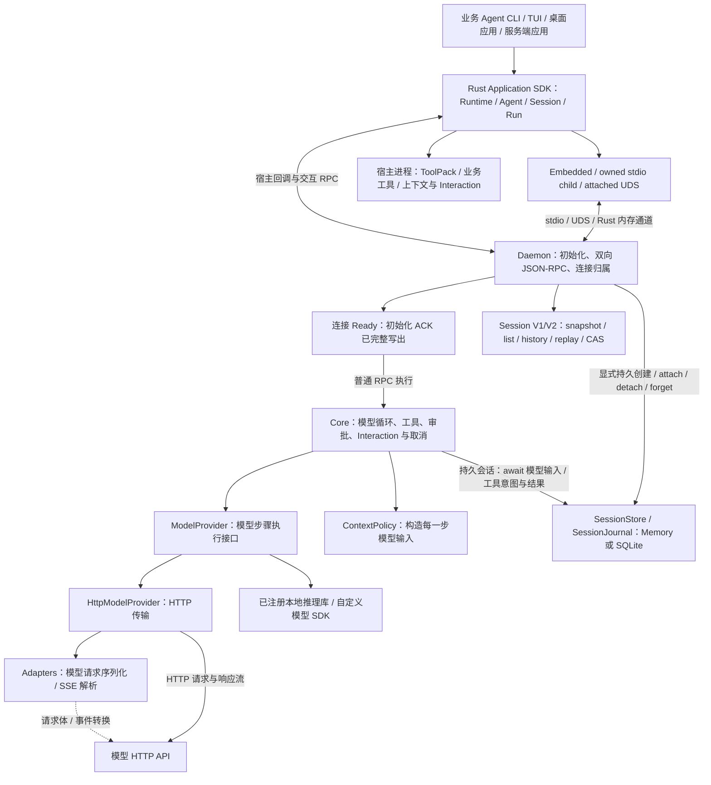

# Whale AI SDK 当前架构

核查日期：2026-09-09；以当前工作区源码为准。能力、限制、开源项目对比与演进建议见 [架构评估](SDK_ARCHITECTURE_REVIEW.md)。原文中的性能比例、零拷贝、生产成熟度等结论没有仓库验证依据，本版改为可由实现和测试确认的描述。

## 分层与运行路径

Whale 的定位是可组合的 Rust Agent Runtime 与 Application SDK。业务应用选择指令、模型、工具与上下文策略；Rust 运行时执行模型／工具循环。工具函数和业务资源保留在宿主应用中。本阶段只交付 Rust SDK。

Engine 调用统一 ModelProvider。HttpModelProvider 负责 HTTP，Adapter 负责协议转换；注册的非 HTTP 实现也接收同样的投影请求并返回模型步骤事件。运行和工具生命周期仍由 Engine 管理。

| 模块 | 当前职责 | 关键入口 |
| --- | --- | --- |
| whale-protocol | Canonical IR、连接初始化、运行／审批／Interaction、Agent 配置、Session V1/V2 及 RPC 数据契约 | [initialization.rs](../crates/whale-protocol/src/initialization.rs)、[canonical.rs](../crates/whale-protocol/src/canonical.rs)、[runs.rs](../crates/whale-protocol/src/runs.rs)、[session_management.rs](../crates/whale-protocol/src/session_management.rs)、[interactions.rs](../crates/whale-protocol/src/interactions.rs) |
| whale-adapters | 三种已支持模型协议的请求、Header 与 SSE 转换 | [traits.rs](../crates/whale-adapters/src/traits.rs)、[openai.rs](../crates/whale-adapters/src/openai.rs)、[responses.rs](../crates/whale-adapters/src/responses.rs)、[anthropic.rs](../crates/whale-adapters/src/anthropic.rs) |
| whale-core | Session 历史与接收预算、模型步骤与 Provider 注册、工具并发、审批、通用 Interaction、参数验证、上下文投影 | [engine.rs](../crates/whale-core/src/engine.rs)、[model.rs](../crates/whale-core/src/model.rs)、[http_provider.rs](../crates/whale-core/src/http_provider.rs)、[provider.rs](../crates/whale-core/src/provider.rs)、[context.rs](../crates/whale-core/src/context.rs)、[interaction.rs](../crates/whale-core/src/interaction.rs) |
| whale-store | CAS 后端、会话日志、Memory/SQLite、启动恢复、lease、未知结果结算与受保护档案回收 | [runtime.rs](../crates/whale-store/src/runtime.rs)、[state.rs](../crates/whale-store/src/state.rs)、[backend.rs](../crates/whale-store/src/backend.rs)、[sqlite.rs](../crates/whale-store/src/sqlite.rs) |
| whale-daemon | NDJSON 双向通信、握手与连接归属、Session 管理、Interaction、持久 attachment、运行接受／终态、自动保留、deadline、宿主回调 | [server.rs](../crates/whale-daemon/src/server.rs)、[initialization.rs](../crates/whale-daemon/src/initialization.rs)、[session_management.rs](../crates/whale-daemon/src/session_management.rs)、[interactions.rs](../crates/whale-daemon/src/interactions.rs)、[recovery.rs](../crates/whale-daemon/src/recovery.rs)、[transport.rs](../crates/whale-daemon/src/transport.rs) |
| Rust Application SDK | Runtime source 所有权、Agent／ToolPack 装配、Session/Run 句柄、V1/V2 观察与管理、Interaction、宿主回调和有界关闭 | [whale-sdk-rust](../crates/whale-sdk-rust/src/lib.rs)、[Rust Application SDK](RUST_APPLICATION_SDK.md) |

## 公开对象与状态归属

- **WhaleRuntime / WhaleClient**：前者是非克隆的连接 owner，负责 source、ready-before-return 与有界 shutdown；后者是可克隆的请求能力句柄。
- **AgentDefinition / Agent**：可移植配置与单独绑定的宿主函数。定义不持有会话历史，Agent 复制配置和工具元数据。
- **Session**：有序 Canonical 历史、模型默认配置、工具注册表和上下文策略；同一 Session 最多一个活动运行。
- **RunHandle**：一次 turn 的句柄，提供独立的事件、结果、快照、审批与取消。
- **Session View V1 / Management V2**：V1 保持既有 Run 投影；V2 提供 owner-scoped list、canonical history 分页、metadata CAS 和 Closing/Closed 回放。`SessionViewHandle` 只读，不拥有会话。
- **Interaction**：可选的 Session-scoped pending snapshot、固定窗口回放与 response transaction；通用请求由宿主渲染和响应，typed approval 保持兼容 facade。
- **ToolContext**：Agent／Session／Run／模型 call 身份、deadline、合作取消与进度。
- **ToolPack / BoundToolPack**：Agent 冻结 manifest，每个 live Session 独立 bind；失败反向 rollback，显式 close 等待 callback 静止后反向释放。
- **ContextPolicy**：从完整会话历史生成每一步模型输入；不覆盖原始历史。
- **ModelProvider / ProviderRegistry**：执行单个模型步骤；启动时注册工厂，由会话选择并持有实现。
- **SessionStore / StoreRuntime / SessionJournal**：后端持久化契约、恢复管理和每个 attachment 的有序提交；不保存宿主 callable。
- **RecoveryKey**：独立于 live thread 的恢复身份与访问密钥，由应用在持久创建前生成并保存。

运行注册表目前位于 Daemon。SDK 的本地句柄保存路由、缓冲和结果副本；不能因此称客户端无状态。完整公开契约见 [保留与会话预算](RETENTION_API.md)、[连接初始化 API](INITIALIZATION_API.md)、[Agent API](AGENT_API.md)、[运行 API](RUN_API.md)、[Interaction API](INTERACTION_API.md)、[执行上下文 API](EXECUTION_CONTEXT_API.md)、[会话关闭 API](SESSION_API.md) 与 [恢复 API](RECOVERY_API.md)。

## 一次工具调用如何完成

1. 首次普通 RPC 自动等待共享 `protocol.initialize`；应用也可显式初始化。SDK 验证版本与能力，Daemon 完整写出 ACK 后才允许普通请求执行。
2. 应用通过 Agent 创建 Session，SDK 安装工具绑定与可选上下文回调。显式持久创建先验证并保留 fresh ID，再提交 Store，之后发布 Session 和创建 ACK。
3. SDK 先安装 turn 路由，再发送 `thread.start_turn`。Daemon 验证归属、参数、忙碌状态及会话接收预算；持久会话先提交 begin_run，接受响应写出后才激活运行。
4. Engine 追加本次输入，每个模型步骤先执行 ContextPolicy 并验证工具调用／结果配对。
5. Engine 校验投影、能力与完整 ModelRequest 字节预算；持久会话先保存实际 ModelRequest，再交给 Provider。HTTP 实现通过 Adapter 转换请求和响应，凭证 Header 不进入持久请求记录。
6. 模型请求工具时，Core 校验参数；需要审批则挂起。审批替换后的参数再次校验，并记录原始与实际执行参数。
7. 持久会话先提交 tool dispatch intent；HostToolBridge 再通过 `tool.execute_host` 调用 SDK。SDK 在协议 reader 之外执行宿主函数，并回传结果。每个完成工具的结果独立提交，不等待其他并行工具。
8. 工具结果按原调用顺序进入历史，再开始下一模型步骤。持久会话通过 journal.finalize 结算并替换权威历史／快照，然后 Daemon 发布唯一外层终态；结果不依赖事件消费者是否及时读取。

参数错误会产生带失败标记的工具结果；模型可以在后续步骤处理这个错误。工具取消是合作信号，不能保证任意宿主函数立即停止，更不撤销已发生的外部副作用。

## 已建立的隔离与一致性

C3 已实现每连接强制握手，协议版本独立于包版本。当前 Rust SDK 使用版本 1；基线能力与 Session V2／Interaction 等可选能力分开协商。并发首次调用共享一次初始化，重复调用复用验证结果。旧 peer、版本／能力不兼容、无效响应、EOF 或握手超时均使客户端失败；没有自动 legacy 回退。失败在 owned transport／子进程清理后发布，握手前反向工具／上下文请求不会执行宿主函数。详见 [连接初始化 API](INITIALIZATION_API.md)。

工具路由区分 Session ID、回调绑定版本和模型 call ID。同名工具可以由不同 Session 绑定不同业务实现；运行途中注册替代实现时，旧运行继续调用原版本。动态注册确认后的后续运行使用新版本。

并行工具通过 FuturesUnordered 及时接收各自完成结果及存储故障，最终按原调用顺序回填历史。允许并行与要求独占的工具由注册表范围的读写屏障协调；这不提供外部数据库事务，也不会自动锁住不同 Session 共享的业务资源。

运行事件带 turn ID 和序号，模型步骤终态不会冒充外层运行终态。慢订阅者会在有界 journal 内自动补回，超出保留窗口时得到明确的 resync 信号；运行和其他消费者继续。回放只覆盖当前 live attachment，进程重启不会恢复逐 token 事件。

显式 Session close 会先阻止该会话的新运行和注册，再取消活动运行，等待终态投递并释放 live 运行记录及 SDK 持有的工具／上下文绑定。V1 观察流按原契约结束；V2 在 `Closing -> Closed` 后保留有界只读 tombstone，可完成最终渲染但不能再写。持久会话同时 detach，保留 Store 中的历史、模型输入和归档 run。其他会话继续使用；原 RunHandle 中的终态结果和已缓冲事件仍可读取，关闭 ID 不能复活为可写 Session。

连接关闭会取消该连接所属活动运行、清理 pending RPC 与宿主绑定，并回收所属 live Session。C4 已实现持久记录 detach 与显式重绑定，SQLite 支持跨重启恢复；每次 attach 使用新 thread／binding ID，归档 run 保留原身份，不能通过旧 RunHandle 继续控制。自动重新连接与自动续跑尚未实现。

## 模型、上下文与审计边界

Canonical IR 提供共同表示，不承诺所有厂商字段无损互转。当前接入 OpenAI Chat Completions、OpenAI Responses 与 Anthropic Messages 的声明子集；Responses 不支持的输入／输出形态会明确失败。支持范围见 [Agent API](AGENT_API.md)。

ProtocolAdapter 接收 Canonical 数据并转换 HTTP/SSE。ModelProvider 已提供独立执行边界，启动期 ProviderRegistry 可以注册本地推理库或自定义 SDK；Rust 通过 provider_ref 选择注册实现。连接握手先确认 `model_providers.v1`，创建前的引用检查再确认具体 Provider 与有效默认模型。不兼容的旧 Daemon 会在普通业务请求前失败。

模型请求验证按消息位置区分内容类型，并检查工具、推理和采样选项。内置 Provider 的能力描述是协议实现子集，未远程探测任意型号。步骤必须显式结束；重复调用 ID、截断及非模型条目在工具执行前失败。兼容 stream override 接收投影视图；直接注入跨进程宿主模型回调仍需额外反向流协议。见 [模型扩展 API](MODEL_PROVIDER_API.md)。

ContextPolicy 已支持完整历史、近期完整 user turn 以及宿主投影。普通会话仍保留内存历史；显式持久会话在派发模型前保存实际投影后的 ModelRequest、历史 revision 与步骤身份，并保留实际工具参数及每个工具结果。恢复 inspect 可读取这些记录，但不提供逐 token 事件重放、HTTP 凭证日志或模型结果可重复性的保证。

## Session 管理与 Interaction 控制面

Session V2 是应用管理投影，不替代 V1。它给当前 connection owner 提供固定成员窗口的 Session list、独立 canonical history 分页、以 V2 view revision 为版本的 metadata whole-map CAS，以及 `Open -> Closing -> Closed` 生命周期回放。list 只枚举当前连接创建或 attach 的 attachment；它不是跨重启的 Store archive catalog。持久产品仍需安全保存 `RecoveryKey`，再显式 inspect/attach。

Interaction 是独立可选能力，不向冻结的 Run/Session 事件枚举追加 variant。启用它的 Agent 可以让工具在受控 continuation 上请求 clarification、form、auth、file/network permission、review 或自定义 schema；Daemon 维护 pending snapshot、有界 Requested/Removed journal 和 first-commit-wins response transaction。响应及其指纹不进入 snapshot、事件或 Store。typed tool approval 与 generic response 共享同一仲裁，但旧 approval RPC 和 Rust 方法保持兼容。SDK 只提供协议、句柄与回调能力，实际 UI、授权策略和凭证交换仍由宿主产品实现。

## 持久化与恢复边界

C4 的 Store 是可选运行配置，普通创建 API 不变。Embedded 宿主把 `StoreRuntime` 安装到 `DaemonServer`；managed/external source 由 daemon 侧安装。完成启动恢复后才接受连接并广告可选 `session_recovery.v1`。MemoryStore 提供同样的 CAS／attach API，但不保证跨进程持久化。SQLite 使用本地 WAL、synchronous FULL 和排他进程锁，不是分布式共享存储。

恢复配置保留模型选择、环境变量凭证引用、工具 schema／审批／并发声明、ContextPolicy、运行默认值与 SessionLimits；配置中移除 live session／binding ID，工具顺序归一化；归档运行仍保留原 thread／turn 身份。attach 要求提供与档案匹配的配置及新的宿主回调，先验证再取得 lease。底层 epoch／owner 防止旧 attachment 写入新会话；创建和存储事务由 owned task 继续完成，取消某个等待者不撤销已接受的写入。

进程中断后，已完成的工具结果保留；已提交 dispatch intent 但没有结果的工具标记为未知，没有 intent 的调用明确记为未派发。恢复为失败的旧运行不自动重试模型、工具或审批。新 turn 在应用按当前 revision 精确确认未知 execution IDs 前拒绝；确认只表示应用接受继续处理不确定性，不表示副作用成功、停止或回滚。

Store 写入失败停止后续派发，终态提交失败不得宣告 Completed；poisoned journal 需关闭所属 runtime 并修复／重新打开 Store 后恢复。显式 forget 仅允许带密钥和当前 revision 删除 detached 内容，同时保留防复活 tombstone。关闭不等于 forget，forget 也不承诺 SQLite 页面或备份的物理擦除。独立嵌入 Core 时，调用方仍需承担 create/begin/finalize/detach 及提交先于发布的外围生命周期。完整接口见 [恢复 API](RECOVERY_API.md)。

## 保留与接收预算

C5 的保留策略默认关闭。Daemon 单一维护任务在空闲期间也执行 sweep，终态 Run 仅在 final notification 成功发送后进入 TTL／数量回收范围；活动、审批、取消及发送未完成／失败的记录受保护。过期 payload 被轻量 owner／accepted-ID 墓碑替代，后续控制或同 ID start 返回 `RunExpired`，不重新执行。SDK 释放已完成路由的强引用，调用方仍持有的结果与缓冲保持可读；快照与控制查询不使用缓存掩盖远端过期。

Store 自动回收只针对 detached、全部 run 终结且没有未确认未知结果的档案。后端提交前重验 revision 与保护条件；受保护记录仍计入预算，所以目标可能无法完全满足。回收释放档案内容并保留认证墓碑，不承诺数据库文件缩小。v1 数据迁移为 v2 时间元数据时获得一次持久化 grace，inspect 不续期。

SessionLimits 在接受新 ID 前检查累计 accepted turn 和历史加输入；Core 在上下文／工具批次前检查历史，并在 journal／provider 前测量完整模型请求。取消与过期不返还次数，持久 attach 恢复归档计数。字节是 UTF-8 JSON，不是 token 估算；已完成工具结果和未知结算不会为了预算被删除。保留配置、Rust 示例与直接 Core／Store 嵌入责任见 [Retention API](RETENTION_API.md)。墓碑、活动会话及调用方持有的对象仍可能增长，不提供固定 RAM／磁盘上限。

## 传输与交付边界

Daemon 支持 stdio 和 Unix Domain Socket。Rust SDK 可用内存通道、owned stdio child 或 attached UDS。Embedded 仍进行 JSON 序列化与反序列化，并非零拷贝直接调用 Engine。自定义 ProviderRegistry 与 StoreRuntime 先安装到 embedded `DaemonServer`；managed/external source 使用 daemon 侧配置，Runtime options 不会跨边界注入 Rust 对象。

External UDS 当前没有 peer credential 或应用层认证。初始化握手只证明协议与 capability 兼容，不能证明对端身份；部署方必须使用宿主控制的目录和 socket 权限，并确保 daemon 来源可信。内置 provider 凭证只支持 daemon 环境变量引用或显式无认证；keychain、OAuth、secret broker 与多租户解析需要未来的凭证扩展或自定义 ModelProvider。

进程边界解决依赖与通信隔离，不构成操作系统权限沙箱。工具默认以宿主进程权限执行。SDK 不要求上层应用采用特定 CLI、Web 框架、Git 工作区或 coding 工具。

Managed Daemon 目前需要宿主另行构建或提供路径，版本与能力握手已实现，但尚无已验证的跨平台自动分发和 SDK／Daemon 匹配安装。当前代码面向 Unix，并在 macOS 实测；Linux CI 待补，Windows 不支持。

## 验证与下一步

测试入口见 [README](../README.md)。默认 `cargo test --workspace` 覆盖协议、Core、Store、Daemon 与 SDK 路径；少量 `#[ignore]` 的真实进程或外部 HTTP fixture 测试用于专项验收。它们不提供外部模型质量或跨平台发行的证明。

历史阶段验收记录（含曾存在的多语言消费者）保存在 [superpowers plans](superpowers/plans/)，仅作实现档案，不代表当前交付范围。Rust `0.1.x` 的 exhaustive 与 extensible API 边界见 [API stability policy](API_STABILITY.md)。

六个 Rust crate 已建立 source-package 元数据、解包编译和仓库外 consumer 验证；接下来的重点是匹配 sidecar binary 分发、完整协议 schema／客户端生成、自动历史压缩与 tokenizer 预算、通用插件依赖与可逆注册、凭证解析和可观测性。当前 `whale-sdk-rust` 没有 attached-only 轻量 feature，选择外部 daemon 仍会编译 embedded/Core/Store 依赖图。完整外部 Codex／Claude Code／OpenCode／pi／DeepSeek Harness runtime 若以后进入范围，应通过独立 AgentBackend 保留其 loop、history、tools、approval、events 与 cancel 语义，不能伪装为单步 ModelProvider。
