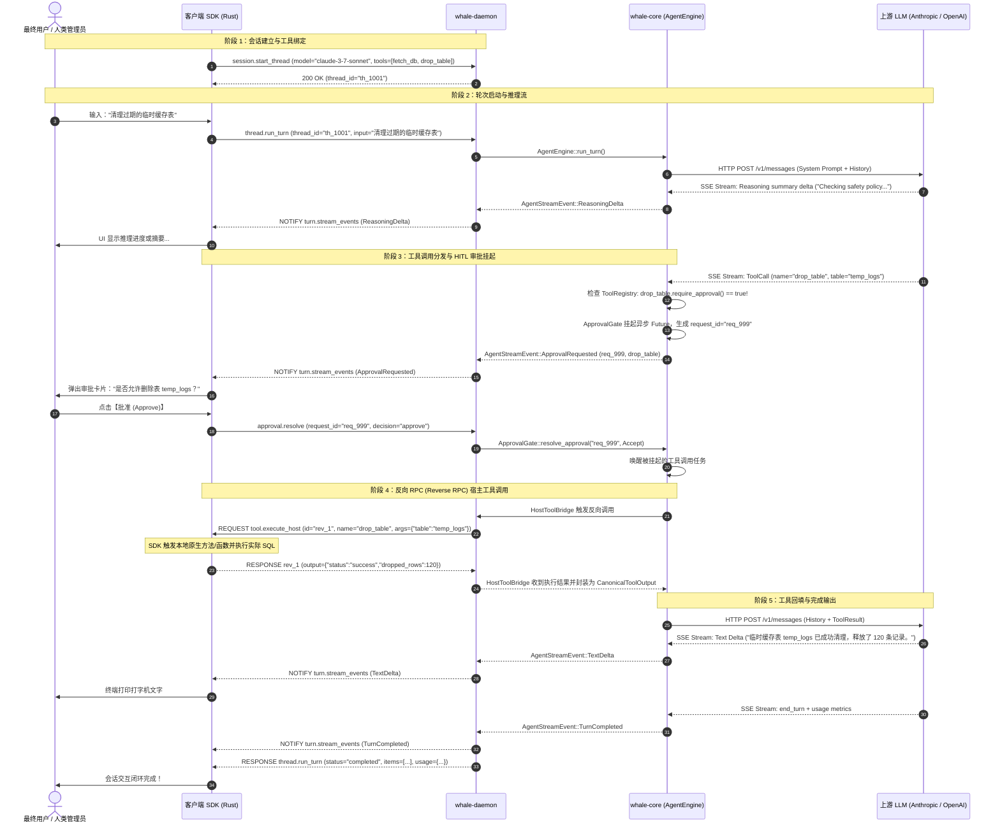

# Whale AI SDK 通信协议规范 (Protocol Specification)

> 每条连接必须先完成 `protocol.initialize`。当前协议版本为 1，SDK 自动或显式握手并检查所需功能；不兼容时关闭连接，不回退到旧协议。版本、能力与错误顺序见 [连接初始化 API](INITIALIZATION_API.md)。下述兼容方法也必须在握手后调用。

> 新增的 `thread.start_turn`、`turn.get`、`turn.cancel`、`turn.resolve_approval` 与 `turn.event` 契约见 [运行 API](RUN_API.md)。本文下方的原有方法作为兼容接口保留。

> `session.start_thread` 的显式模型协议、端点与凭证配置，以及可复用 Agent 装配方式见 [Agent API](AGENT_API.md)。

> `session.close` 的归属、取消与终态顺序、资源释放和重复关闭语义见 [会话关闭 API](SESSION_API.md)。

> `provider.inspect`、`provider_ref`、模型能力描述及扩展执行接口见 [模型 Provider API](MODEL_PROVIDER_API.md)。运行选项增加 `thinking_budget` 与 `prompt_caching`；缺省继承，显式 false 覆盖当前回合，未知字段拒绝。

> 执行上下文、工具绑定版本、参数审计，以及 `context.build_host`、`context.cancel_host`、`tool.cancel_host`、`tool.report_progress` 见 [执行与模型上下文](EXECUTION_CONTEXT_API.md)。`tool.execute_host` 新增可选 `thread_id`、`binding_id`、`context`：绑定 ID 标识回调版本，顶层 `call_id` 关联反向 RPC，`context.call_id` 对应模型调用 ID；三者不可混用。

> C4 新增可选 `session_recovery.v1`：`session.create_persistent`、`session.recovery.inspect`、`session.recovery.attach`、`session.recovery.acknowledge` 与 `session.recovery.forget`。持久会话必须显式创建；普通 `session.start_thread` 不因此改变。密钥鉴权、存储顺序、新 live ID、归档与错误码见 [恢复 API](RECOVERY_API.md)。

> C5 新增 `session_limits.v1`（新 Daemon 始终广告）与 `run_retention.v1`（配置保留策略时广告）。`AgentDefinition`／`StartThreadParams.limits` 传递正整数会话预算；配置 SDK 在派发前要求对应能力。`-32030 RunExpired` 和 `-32031 SESSION_LIMIT_EXCEEDED` 见 [保留与会话预算](RETENTION_API.md)。默认不启用保留或预算，八项基础能力不变。

> Session read model 使用可选能力 `session_views.v1`；有界回放使用可选能力 `session_event_replay.v1`。两者不属于 SDK 的八项基础能力。`session.get` 返回同一临界区捕获的权威快照和 Session cursor，`session.subscribe` 返回固定上界的回放页，`session.event` 发布同一 cursor 空间中的 live 事件。现有 `turn.event` wire 保持不变。

> Session management 使用四个可选能力：`session_catalog.v1`、`session_history.v1`、`session_metadata_cas.v1` 和 `session_lifecycle_replay.v1`。它们提供 owner-local 列表、canonical history 分页、metadata CAS，以及带 Closing/Closed 的独立 V2 view/replay wire；全部保持在基础 `PROTOCOL_CAPABILITIES` 之外，V1 wire 不变。

> 通用挂起请求使用可选能力 `interactions.v1`。它提供独立的 Session pending snapshot、Run filter、固定窗口 replay、`Requested`／`Removed` notification 和 first-commit-wins response；不扩展 `AgentDefinition`、`StartThreadParams`、`RunSnapshot` 或既有 Run／Session event。Rust 宿主 API、安全 payload 与恢复边界见 [Interaction API](INTERACTION_API.md)。

## 1. 协议概览与物理帧格式 (Wire Framing)

Whale AI SDK 的客户端与服务端之间采用标准的 **JSON-RPC 2.0** 规范构建全双工交互通道。

### 1.1 传输物理层与分帧策略
- **传输媒介**:
  - **Rust 内存通道 (Embedded)**: SDK 与同进程 `DaemonServer::run` 之间仍使用完整 NDJSON 序列化和相同协议状态机。
  - **标准输入输出 (Stdio IPC)**: 用于客户端以子进程方式拉起 `whale-daemon`。
  - **Unix Domain Socket (UDS)**: 针对本机常驻服务守护进程（如监听 `<host-controlled-runtime-dir>/whale.sock`）。
- **帧边界格式 (Framing)**: **按行分隔的 JSON (Newline-delimited JSON / NDJSON)**。
  - 每一个合法的 JSON-RPC 消息（Request、Response 或 Notification）必须被序列化为**单行紧凑 JSON 文本**，并以单个换行符 `\n` (`0x0A`，LF) 结尾。
  - 消息行内部**严禁包含未转义的换行符**；字符串值内部的换行符必须进行标准 JSON 转义（即 `\n`）。
  - 空行或纯空白字符行由读取端自动忽略。

---

## 2. 基础消息信封结构 (Base Envelope Schemas)

严格遵循 [JSON-RPC 2.0 规范](https://www.jsonrpc.org/specification)。

### 2.1 请求信封 (Request Envelope)
由调用方（Client 或进行 Reverse RPC 时的 Daemon）发起：
```json
{
  "jsonrpc": "2.0",
  "id": "req_001_abc",
  "method": "method_name",
  "params": { ... }
}
```
- `jsonrpc`: 必须固定为 `"2.0"`；
- `id`: 请求标识符，可为非空字符串 (`string`) 或整数 (`integer`)；
- `method`: 调用的远程方法名称；
- `params`: 结构化参数对象（`object`）。

### 2.2 响应信封 (Response Envelope)
对请求处理完成后的应答：
```json
{
  "jsonrpc": "2.0",
  "id": "req_001_abc",
  "result": { ... }
}
```
或发生错误时：
```json
{
  "jsonrpc": "2.0",
  "id": "req_001_abc",
  "error": {
    "code": -32602,
    "message": "Invalid parameters",
    "data": { ... }
  }
}
```
响应必须且只能包含 `result` 或 `error`；缺省的一侧不会序列化为 `null`。
**标准错误代码表**:
| 错误代码 (code) | 宏常量 / 含义 | 说明 |
| :--- | :--- | :--- |
| `-32700` | `PARSE_ERROR` | 收到无效 JSON 文本，解析失败 |
| `-32600` | `INVALID_REQUEST` | 发送的 JSON 不是合法的 JSON-RPC 2.0 请求对象 |
| `-32601` | `METHOD_NOT_FOUND` | 请求的方法不存在或未注册 |
| `-32602` | `INVALID_PARAMS` | 方法参数无效、类型不符或缺少必要字段 |
| `-32603` | `INTERNAL_ERROR` | 内部引擎运行时故障或未捕获的系统异常 |

### 2.3 通知信封 (Notification Envelope)
单向单播/广播消息，**严禁包含 `id` 字段**，接收方无需也不得返回响应：
```json
{
  "jsonrpc": "2.0",
  "method": "turn.stream_events",
  "params": { ... }
}
```

---

## 3. Client -> Daemon 方法契约 (Client Requests)

### 3.1 `session.start_thread`
创建或初始化一个独立的对话线程（Thread Session）。

#### 请求参数 (`StartThreadParams`)
| 字段名 | 类型 | 必填 | 说明 |
| :--- | :--- | :--- | :--- |
| `session_id` | `string` | 否 | 自定义线程 ID。若为空，Daemon 自动生成 `th_<uuid>` |
| `provider` | `string` | 否 | 指定后端模型供应商（`"anthropic"` 或 `"openai"`）。若缺省，根据 `model` 名称自动推断 |
| `provider_ref` | `string` | 否 | 选择 Daemon 启动时注册的模型实现；与 `provider`／`provider_config` 互斥 |
| `provider_config` | `ProviderConfig` | 否 | 显式选择协议、base URL 和凭证引用；与 `provider` 同时提供时须属于同一协议族，见 Agent API |
| `options` | `RunTurnOptions` | 否 | 会话默认模型选项；单轮覆盖不修改这些默认值 |
| `agent_name` | `string` | 否 | 宿主执行上下文中的 Agent 名称 |
| `context_policy` | `ContextPolicyConfig` | 否 | 默认完整历史，也可选择近期完整回合或宿主投影，见执行与模型上下文 |
| `limits` | `SessionLimits` | 否 | 可选 `max_accepted_turns`、`max_history_bytes`、`max_model_request_bytes`，均为正 u64；字节按 UTF-8 JSON 计数，不是 token |
| `model` | `string` | 是 | 模型标识符（如 `"claude-3-7-sonnet"`, `"gpt-4o"`, `"o3-mini"`） |
| `system_prompt` | `string` | 否 | 设定给模型的系统提示词指令 |
| `tools` | `RegisterToolDefinition[]` | 否 | 随线程初始挂载的工具定义列表 |
| `metadata` | `object` | 否 | 业务自定义上下文元数据键值对 |

#### 工具定义模型 (`RegisterToolDefinition`)
```json
{
  "binding_id": "opaque-session-binding-id",
  "name": "calc",
  "description": "Evaluate arithmetic expression",
  "parameters": {
    "type": "object",
    "properties": {
      "expression": { "type": "string" }
    },
    "required": ["expression"]
  },
  "supports_parallel": true,
  "require_approval": false,
  "is_host_tool": true
}
```
- `binding_id` (可选字符串): 宿主绑定的不透明版本身份，与展示给模型的工具名分离；Rust SDK 为 host binding 生成并管理它。
- `supports_parallel` (布尔，默认 `true`): 是否允许并发执行（只读工具为 `true`；写文件、改库等排他性工具为 `false`）。
- `require_approval` (布尔，默认 `false`): 执行前是否必须通过 Human-In-The-Loop 审批。
- `is_host_tool` (布尔，默认 `false`): 为 `true` 时由 SDK 宿主环境通过反向 RPC 执行。

#### 响应结果 (`StartThreadResult`)
```json
{
  "jsonrpc": "2.0",
  "id": 1,
  "result": {
    "thread_id": "th_6a20d437-0cfc-40ad-bc14-998877665544",
    "created_at": "2026-09-07T12:00:00Z"
  }
}
```

---

### 3.2 `thread.run_turn`
向指定线程投递新的用户输入，启动单轮 Agent 执行状态机。

#### 请求参数 (`RunTurnParams`)
| 字段名 | 类型 | 必填 | 说明 |
| :--- | :--- | :--- | :--- |
| `thread_id` | `string` | 是 | 目标会话线程的 ID |
| `input_items` | `CanonicalItem[]` | 是 | 本轮输入项数组（通常包含一个 `UserMessage`） |
| `options` | `RunTurnOptions` | 否 | 动态覆盖模型采样参数 |

#### 选项参数 (`RunTurnOptions`)
```json
{
  "model": "claude-3-7-sonnet",
  "temperature": 0.7,
  "max_tokens": 4096,
  "reasoning_effort": "high",
  "thinking_budget": 2048,
  "prompt_caching": true
}
```

`thinking_budget` 必须为正整数；作为单轮覆盖时，`prompt_caching` 的缺省值继承 Session 默认，
显式 `false` 关闭本轮缓存请求。Provider 能力检查会拒绝不支持的选项。

#### 响应结果 (`RunTurnResult`)
在整轮 Agent 交互彻底收敛结束（或发生致命故障）后同步返回：
```json
{
  "jsonrpc": "2.0",
  "id": 2,
  "result": {
    "turn_id": "turn_c0a80101-1122-3344-5566-778899aabbcc",
    "thread_id": "th_6a20d437-0cfc-40ad-bc14-998877665544",
    "status": "completed",
    "items": [
      {
        "type": "user_message",
        "id": "item_u1",
        "content": [{ "type": "text", "text": "Calculate 15 + 25" }]
      },
      {
        "type": "tool_call",
        "id": "item_t1",
        "call_id": "call_001",
        "name": "calc",
        "arguments": { "expression": "15 + 25" },
        "raw_arguments": "{\"expression\":\"15 + 25\"}"
      },
      {
        "type": "tool_result",
        "id": "item_r1",
        "call_id": "call_001",
        "output": { "type": "text", "text": "40" },
        "is_error": false
      },
      {
        "type": "assistant_message",
        "id": "item_a1",
        "content": [{ "type": "text", "text": "15 + 25 equals 40." }],
        "phase": "final_answer"
      }
    ],
    "usage": {
      "input_tokens": 150,
      "output_tokens": 35,
      "reasoning_tokens": 0,
      "cache_creation_input_tokens": 120,
      "cache_read_input_tokens": 0
    }
  }
}
```

---

### 3.3 `session.register_tools`
在现有会话中动态追加注册新的工具（支持 Host 反向工具）。

#### 请求参数 (`RegisterToolsParams`)
```json
{
  "jsonrpc": "2.0",
  "id": 3,
  "method": "session.register_tools",
  "params": {
    "thread_id": "th_6a20d437-0cfc-40ad-bc14-998877665544",
    "tools": [
      {
        "name": "fetch_user_profile",
        "description": "Fetch user by ID from internal CRM",
        "parameters": {
          "type": "object",
          "properties": { "user_id": { "type": "string" } },
          "required": ["user_id"]
        },
        "supports_parallel": true,
        "require_approval": false,
        "is_host_tool": true
      }
    ]
  }
}
```

#### 响应结果 (`RegisterToolsResult`)
```json
{
  "jsonrpc": "2.0",
  "id": 3,
  "result": {
    "registered_count": 1
  }
}
```

---

### 3.4 `approval.resolve`
人类在环（HITL）审批决策仲裁接口。

#### 请求参数 (`ApprovalResolveParams`)
```json
{
  "jsonrpc": "2.0",
  "id": 4,
  "method": "approval.resolve",
  "params": {
    "request_id": "req_appr_99881122",
    "decision": "approve",
    "feedback": "Approved by security officer"
  }
}
```
- `decision`: `"approve"` 或 `"reject"`；
- `feedback`: 可选的审批批注或驳回原因说明。

#### 响应结果 (`ApprovalResolveResult`)
```json
{
  "jsonrpc": "2.0",
  "id": 4,
  "result": {
    "resolved": true,
    "request_id": "req_appr_99881122"
  }
}
```

---

### 3.5 `tool.execute_host_result`
客户端向 Daemon 汇报宿主本地工具执行结果的显式方法（备选方案，亦可直接作为对 `tool.execute_host` 的标准 JSON-RPC 响应）。

#### 请求参数 (`ToolExecuteHostResult`)
```json
{
  "jsonrpc": "2.0",
  "id": 5,
  "method": "tool.execute_host_result",
  "params": {
    "call_id": "call_001",
    "output": {
      "type": "structured",
      "data": { "status": "success", "rows_affected": 3 }
    },
    "is_error": false
  }
}
```

#### 响应结果
```json
{
  "jsonrpc": "2.0",
  "id": 5,
  "result": {
    "acknowledged": true
  }
}
```

---

### 3.6 持久会话与恢复（可选能力）

下列请求均须先完成初始化。仅配置 Store 并成功完成启动恢复的 Daemon 广告 `session_recovery.v1`。

| 方法 | 参数 | 结果 |
| --- | --- | --- |
| `session.create_persistent` | `key`, `session: StartThreadParams`, `run_defaults` | `thread: StartThreadResult`, `key`, `epoch` |
| `session.recovery.inspect` | `key` | `RecoverySnapshot` |
| `session.recovery.attach` | `key`, `expected_revision`, `session`, `run_defaults` | `thread`, `key`, `epoch` |
| `session.recovery.acknowledge` | `key`, `expected_revision`, `execution_ids` | `RecoverySnapshot` |
| `session.recovery.forget` | `key`, `expected_revision` | `recovery_id`, `forgotten` |

`key` 是调用者预先保存的 `{recovery_id, secret}`；创建和 attach 中的 `session.session_id` 必须是客户端新生成的 UUID，Daemon 不得替换该 ID。`run_defaults` 保存 `max_steps`（默认 10）和可选 `timeout_ms`。`expected_revision` 是当前正整数 u64；确认操作要求精确的全部未确认 execution ID，并且只能由当前 attachment 所属连接调用。

`RecoverySnapshot` 包含 `recovery_id`、`revision`、`epoch`、`attached`、归一化 `configuration`、完整 `history`、原始身份的 `runs` 及 `unknown_executions`。每个归档 run 包含 `snapshot`、`model_inputs`、`effective_options`；模型输入记录包含实际请求、步骤身份、history revision、完成标志和 usage。摘要不包含密钥摘要、内部 owner 或可调用绑定。

持久创建与运行接受的存储提交先于成功响应，终态提交先于 `turn.event` 的 `finished`。持久注册先更新配置再返回确认。close/EOF 清除 live 状态但保留档案，直到显式 forget 或配置的 detached 自动回收；forget 仅允许 detached 状态并留下防止复活的 tombstone。重启恢复不派发模型或工具，也不复活审批；未终结 run 归档为 `failed/RECOVERY_INTERRUPTED`。已有 dispatch intent 但没有 durable outcome 的工具调用记为未知，后续新 turn 在显式确认前拒绝。

错误码：`-32020 RECOVERY_UNAVAILABLE` 表示无 Store；`-32021 RECOVERY_REJECTED` 表示确定拒绝；`-32022 STORE_FAILED` 表示存储失败或未知提交结果，不得假定未写入后直接重试副作用。新 turn 接收预算超限返回 `-32031 SESSION_LIMIT_EXCEEDED`，不占用新 ID；已接受 run 后续超限以快照错误 `SESSION_LIMIT_EXCEEDED` 终结。

完整类型以 [recovery.rs](../crates/whale-protocol/src/recovery.rs) 为准，SDK 示例与失败处理见 [Recovery API](RECOVERY_API.md)。

---

### 3.7 Session view 与有界回放（可选能力）

`session_views.v1` 提供 `session.get`，`session_event_replay.v1` 提供
`session.subscribe` 和 `session.event`。客户端必须先从初始化结果确认对应能力；这些能力没有加入
`PROTOCOL_CAPABILITIES` 基础要求。

`SessionCursor` 的 wire 形状固定为：

```json
{"thread_id":"thread-a","stream_id":"stream-a","seq":7}
```

`seq` 在一个 live Session attachment 内从零开始并按可见 projection mutation 严格递增。
`RunEvent.seq` 仍只属于单个 Run，Store recovery revision 仍只用于持久化 CAS。持久 Session
重新 attach 时获得新的 `thread_id` 和 `stream_id`，旧 cursor 不会恢复。

`session.get` 参数为 `{thread_id, history_limit}`；`history_limit` 必须在 1 到 1024
之间。结果为 `SessionSnapshot`：

- `summary` 只包含安全的 thread identity、agent name、初始 metadata、毫秒时间戳和可见 revision；
- `history` 是 `SessionHistoryWindow {items,start_index,total_items,capacity}`；它保留
  canonical history 的确定性尾部、按 item ID 去重，并为后续分页保留绝对索引；
- `active_run` 包含现有 `RunSnapshot` 以及 text、reasoning、tool raw arguments 等 partial item projection；
- `last_run` 仅保存最近 terminal Run 的轻量摘要；
- `cursor` 与 summary revision 在同一临界区捕获。

`SessionHistoryWindow.items.len()` 等于 `min(total_items, capacity)`，且
`start_index + items.len() == total_items`。Reducer 追加完成项时同步增加 `total_items`，
超过 capacity 时从窗口头部移除；terminal Run reconciliation 采用同一规则，所以从快照加
连续事件得到的窗口与相同 cursor 下的 `session.get` 逐字段相等。

Rust 的 `SessionSnapshot::apply` 是原子 reducer：已应用 cursor 返回 `Ok(false)`，跨 live
attachment 返回 `SessionProjectionError::StreamMismatch`，不连续 cursor 返回
`SequenceGap`，快照、事件或 reducer invariant 错误返回 `InvalidState`；错误时原快照保持不变。

快照和事件不得包含 recovery secret、resolved credential、provider config、system prompt、callback
binding ID 或 unknown-effect 内部状态。

`session.subscribe` 是无服务端订阅任务的分页 barrier：

```json
{
  "thread_id":"thread-a",
  "after":{"thread_id":"thread-a","stream_id":"stream-a","seq":7},
  "limit":128
}
```

第一次请求省略 `through`。响应在同一临界区把当时的 current cursor 冻结为 `through`：

```json
{
  "events":[],
  "resume_after":{"thread_id":"thread-a","stream_id":"stream-a","seq":7},
  "through":{"thread_id":"thread-a","stream_id":"stream-a","seq":9},
  "has_more":true,
  "gap":null
}
```

后续页将上一页的 `resume_after` 作为 `after`，并原样携带同一个 `through`。每一页只返回
`after.seq < event.seq <= through.seq` 的连续事件；`resume_after` 是本页最后一个 event cursor，
空页时等于请求的 `after`。`limit` 必须在 1 到 256 之间。分页期间产生的新事件不会进入已经
冻结的窗口。

Daemon 维护一个连续 `replay_floor`：`after.seq >= replay_floor.seq` 才能完整回放后缀。
按数量或序列化字节淘汰事件会推进 floor；无法保留的单个 oversized event 也将 floor 推进到
该 event cursor。`after` 低于 floor 返回结构化 retention gap。不同 stream 返回
stream-reset gap；未来 sequence、不同 thread 或不一致的固定 `through` 是无效参数。

```json
{
  "reason":"retention",
  "requested":{"thread_id":"thread-a","stream_id":"stream-a","seq":2},
  "replay_floor":{"thread_id":"thread-a","stream_id":"stream-a","seq":5},
  "current":{"thread_id":"thread-a","stream_id":"stream-a","seq":9},
  "session_revision":9
}
```

收到 gap 后，调用方必须重新获取 `SessionSnapshot`，不可将残余后缀应用到未知状态。
事件 journal 只覆盖当前 live attachment，独立于 Run payload retention 和 durable Store retention。
交付按 cursor 排序；replay/live 合并时允许重复，调用方按 cursor 去重，协议不承诺跨传输故障的
exactly-once。

完整类型与纯校验规则见
[session_views.rs](../crates/whale-protocol/src/session_views.rs)。

---

### 3.8 Session management 与 V2 生命周期回放（可选能力）

Stage 2.2 保留 3.7 的 V1 方法和 JSON 形状，并增加独立的 V2 管理投影：

| 能力 | 方法／通知 |
| --- | --- |
| `session_catalog.v1` | `session.list` |
| `session_history.v1` | `session.history` |
| `session_metadata_cas.v1` | `session.metadata.replace` |
| `session_lifecycle_replay.v1` | `session.get.v2`、`session.subscribe.v2`、`session.event.v2` |

客户端必须在对应业务 RPC 前检查能力。V1 客户端不会订阅 V2 route，因此不会收到含 metadata 或 lifecycle variant 的 V2 notification。`SessionCursor` 与 `SessionCursorV2` 拥有独立 stream/sequence；V2 的 `SessionSummaryV2.view_revision` 始终等于 `SessionCursorV2.seq`，每个 Run、metadata 或 lifecycle 可见变更都会推进它。它们都不能替代 Run event sequence、Store recovery revision 或 recovery epoch。

daemon 从当前 transport connection 推导 owner；请求不接受 owner 参数。`session.list` 只枚举这个 owner 已发布的 Open、Closing 和未淘汰 Closed 记录，不枚举 detached Store records；未知 ID 与其他 owner 的 ID 返回相同的 `Unavailable`。连接 EOF 会先执行现有取消／持久 detach 清理，再删除完整 owner namespace。

`session.get.v2` 接受 `{thread_id,history_limit}`，其中 `history_limit` 为 1–1024，返回 `SessionSnapshotV2`：V2 summary、`open|closing|closed` lifecycle、`ephemeral` 或不含 secret 的 persistent descriptor、canonical history tail、active/last Run 和 V2 cursor。`SessionSnapshotV2::apply` 是规范 reducer：只接受连续的同 stream 事件、整体替换 metadata，并只允许 `Open -> Closing -> Closed`；Closed 后无合法事件。

`session.subscribe.v2` 使用与 V1 相同的固定 `through` 分页规则，但只接受 `SessionCursorV2`，每页 1–256 个事件，并在结果中返回 `lifecycle`。因此从 Closed cursor 订阅会得到空页和 `Closed`，无需等待 notification 即可结束。V2 journal 是每 Session 最多 1024 个事件／4 MiB 的连续后缀；retention 或旧 attachment 产生的 replay gap 要求重新读取 V2 snapshot。

`session.list` 默认由 SDK 请求 64 条、协议上限为 256 条／1 MiB。第一页冻结 owner-local `through_ordinal`；并发创建的 Session 不进入后续页。opaque `SessionListCursor` 绑定 owner、catalog generation、固定窗口和五分钟 expiry。Closed tombstone 被移除会推进 generation，旧页游标返回 `ListCursorExpired`，不会静默跳项。

`session.history` 返回独立于 snapshot tail 的 canonical history 页。第一页可省略边界以冻结当前末尾，也可提供 `SessionHistoryAnchor` 从指定绝对 index 向前读取；后续页只能使用 opaque `SessionHistoryPageCursor`。页内项目保持从旧到新，默认 128、上限 256 条／1 MiB，并发 append 高于固定 `through` 的部分不会进入该窗口。history anchor、history page cursor 与 list cursor 是不同 Rust/wire 类型；旧 stream 返回 `HistoryStreamReset`，保留边界之后的缺口返回含 requested/floor/current_end 的 `HistoryGap`。

`session.metadata.replace` 只接受 Open Session，参数为 `thread_id`、完整替换 map 与 `expected_view_revision`。相同 map 返回 `changed=false` 且不产生事件；过期 revision 返回当前 V2 revision/cursor 的 `RevisionConflict`。持久 Session 先提交 Store metadata，再发布 V2 `MetadataChanged`；响应丢失可能产生 `StorageFailure {outcome_unknown:true}`，调用方应通过 recovery 或 fresh snapshot 协调，不能假定未提交后直接重放副作用。

显式 close 依次发布唯一的 Closing、等待已接受 Run 的终态并完成持久 detach、发布唯一的 Closed，然后才完成 close response。V1 stream 继续按原行为直接结束；V2 live／late subscriber 可回放 Closing、余下 Run 事件和 Closed，随后返回 `None`。read-only V2 handle 可在 tombstone 存续期间读取，但不能延长其寿命或执行 Run、metadata、tool、context、cancel、close 等写操作。每个 owner 最多保留 128 个／64 MiB Closed tombstone，TTL 为十分钟；淘汰后返回 `TombstoneExpired`。持久 recovery record 仍存在，认证 attach 会创建新的 thread、V1/V2 stream 和 revisions，旧 history/replay cursor 不会复活。

Session management 错误在 `JSONRPCError.data` 中使用 `SessionManagementErrorData {kind,...}`。稳定代码为 `-32040`（state）、`-32041`（revision conflict）、`-32042`（cursor rejected）和 `-32043`（history gap）；持久写失败沿用 `-32022 STORE_FAILED`。SDK 必须同时按 code 与 `kind` 映射，不能解析诊断 message；缺失、畸形或与 code 不匹配的数据是无效投影。metadata 新写入上限为 64 KiB、256 个顶层 key、深度 16；单个 list/history 项超过响应字节限制时返回 typed `ResourceLimit`，不能静默省略。

完整类型、校验、reducer 与错误数据见 [session_management.rs](../crates/whale-protocol/src/session_management.rs)，Rust read/write API 与恢复策略见 [Session View API](SESSION_VIEW_API.md)。

---

### 3.9 Interaction snapshot、回放与响应（可选能力）

`interactions.v1` 只有在连接初始化结果中明确广告、且 Session 创建／持久创建／恢复 attach
使用扁平字段 `interactions_enabled: true` 时可用。该字段由 additive wrapper 提供，不修改
原 `StartThreadParams`；未 opt-in 的请求与 typed approval JSON 保持不变。

| Method | Params | Result |
| --- | --- | --- |
| `session.interactions.get` | `{thread_id}` | `InteractionSnapshot {thread_id,cursor,pending}` |
| `session.interactions.subscribe` | `{thread_id,after,through?,limit}` | 固定窗口 `SubscribeInteractionsResult` |
| `turn.interactions.get` | `{thread_id,turn_id}` | 同一 Session cursor 上的 `TurnInteractionSnapshot` |
| `turn.request_interaction` | callback identity 与扁平 `InteractionRequest` | 挂起至响应或清理的 `InteractionResponse` |
| `turn.respond_interaction` | `{thread_id,turn_id,request_id,response}` | `{request_id,resolved}` |

Interaction cursor 为 `{thread_id,stream_id,seq}`，与 Run／Session event cursor 及 Store revision
无关。`session.interactions.subscribe` 第一页省略 `through` 时固定当前 cursor；后续页必须回传
同一 `through`。每页 `limit` 为 1–256。journal 保留当前 live attachment 的连续后缀，最多
1024 个 envelope／4 MiB。低于 replay floor 返回 retention gap；旧 attachment cursor 返回
stream-reset gap。收到 gap 后必须重新获取响应附带或独立读取的 authoritative snapshot。

Daemon 对每次 pending-set 变更先分配连续 cursor、提交 snapshot/journal，再异步发送：

```json
{"jsonrpc":"2.0","method":"session.interaction_event","params":{"thread_id":"s","cursor":{"thread_id":"s","stream_id":"i","seq":1},"occurred_at_ms":1,"type":"requested","interaction":{"request_id":"q","turn_id":"r","kind":"example.review","title":"Review","payload":{"digest":"sha256:..."}}}}
```

`Requested` 携带可回放的 `PendingInteraction`；`Removed` 只携带 `request_id`、`turn_id` 和开放
字符串 `cause`，永远不携带 response 或 fingerprint。客户端通过 cursor 合并 replay/live 并
去重，不能把 notification 到达视为状态提交点。

`turn.request_interaction` 只接受当前 connection 中仍活跃的 `tool.execute_host` callback：
`thread_id`、`turn_id`、`host_call_id` 和 UUID `request_id` 必须属于同一个 origin。该 RPC
在同一全双工连接上等待 host 回答，reader 必须继续处理其他 response、progress 和 Session
消息，不能在 reverse callback dispatch 内阻塞连接读取。

首次有效 `turn.respond_interaction` 在一个 daemon-owned transaction 中验证 owner/Run/request、
64 KiB 上限和 Draft 2020-12 response schema，确认 continuation 仍可接收，提交 typed Session
投影（若有）与 `Removed(cause="resolved")`，再完成一次性交付。RPC 只有在全部步骤成功后才
返回 `resolved:true`；notification 的异步到达不是提交点。相同 canonical JSON 的并发／顺序
重试等待同一事务的最终成功或失败；不同响应返回 `-32051`。无效响应返回 `-32052` 并保持
pending。其他稳定错误为 `-32050` not found 和 `-32053` unavailable；owner 校验先于请求
存在性披露。

`whale.tool_approval` 是既有 typed approval 的通用投影。`turn.respond_interaction`、
`turn.resolve_approval`、`approval.resolve` 和 Core typed resolution 共用响应事务；原
`ApprovalRequested`、typed 参数／结果和 `RunSnapshot.pending_approvals` 不变。

request title/payload/schema 和 Requested replay 都属于可显示、可记录数据，不得包含 token、
密码、cookie、私钥等 credential。response 只出现在必要的 client-to-daemon response RPC 和
精确 producer 内存中；snapshot、notification、replay、Store 与日志都不保留。Daemon 仅在
进程内保存随机 key 的 HMAC-SHA256 canonical-response fingerprint 用于等价重试，绝不发布。
持久配置 V3 只保存 `runtime_features.interactions_enabled`；restart 中断旧 Run，attach 创建
fresh zero cursor，不持久化 pending request、response、fingerprint 或 waiter，也不重新提示。

---

## 4. Daemon -> Client 请求与通知规范 (Daemon Pushes)

### 4.1 反向 RPC 请求：`tool.execute_host` (Reverse RPC Request)
当 LLM 决策调用某个标记为 `is_host_tool: true` 的工具时，`whale-daemon` 充当 RPC 客户端，向宿主 SDK 客户端发起远程过程调用。

#### 请求格式
```json
{
  "jsonrpc": "2.0",
  "id": "reverse_call_66778899",
  "method": "tool.execute_host",
  "params": {
    "call_id": "call_001",
    "namespace": null,
    "name": "fetch_user_profile",
    "arguments": {
      "user_id": "usr_9981"
    }
  }
}
```

#### 客户端响应格式 (Client Standard Response)
宿主客户端处理完成后，沿相同 IPC 连接应答：
```json
{
  "jsonrpc": "2.0",
  "id": "reverse_call_66778899",
  "result": {
    "call_id": "call_001",
    "output": {
      "type": "structured",
      "data": {
        "id": "usr_9981",
        "name": "Alice Smith",
        "role": "Platform Engineer"
      }
    },
    "is_error": false
  }
}
```

---

### 4.2 实时流式事件通知：`turn.stream_events` (Notification)
在轮次执行期间，Daemon 持续以单向通知形式将内部事件实时推送至客户端。

#### 通知格式 (`StreamEventsParams`)
```json
{
  "jsonrpc": "2.0",
  "method": "turn.stream_events",
  "params": {
    "turn_id": "turn_c0a80101-1122-3344-5566-778899aabbcc",
    "thread_id": "th_6a20d437-0cfc-40ad-bc14-998877665544",
    "event": { ... }
  }
}
```

#### 事件载荷 `AgentStreamEvent` 常见变体示例

以下用于说明 wire 形状，不是穷举清单；完整类型（包括工具进度与执行开始事件）以
[`whale_protocol::events`](../crates/whale-protocol/src/events.rs) 为准。
1. **`turn_started`**:
   ```json
   { "type": "turn_started", "turn_id": "turn_1", "thread_id": "th_1" }
   ```
2. **`item_started`**:
   ```json
   { "type": "item_started", "turn_id": "turn_1", "item_id": "item_1", "item_type": "reasoning", "phase": "commentary" }
   ```
3. **`reasoning_delta`**:
   ```json
   { "type": "reasoning_delta", "turn_id": "turn_1", "item_id": "item_1", "delta": "Analyzing user permissions..." }
   ```
4. **`reasoning_signature`**:
   ```json
   { "type": "reasoning_signature", "turn_id": "turn_1", "item_id": "item_1", "signature": "sig_rsa4096_..." }
   ```
5. **`text_delta`**:
   ```json
   { "type": "text_delta", "turn_id": "turn_1", "item_id": "item_2", "delta": "The calculated total is " }
   ```
6. **`tool_call_delta`**:
   ```json
   { "type": "tool_call_delta", "turn_id": "turn_1", "item_id": "item_3", "call_id": "call_1", "delta": "{\"path\":\"/etc/hosts\"}" }
   ```
7. **`approval_requested`** (触发 HITL 暂停):
   ```json
   {
     "type": "approval_requested",
     "turn_id": "turn_1",
     "request_id": "req_appr_01",
     "tool_call": {
       "type": "tool_call",
       "id": "item_3",
       "call_id": "call_1",
       "name": "delete_table",
       "arguments": { "table_name": "temp_logs" },
       "raw_arguments": "{\"table_name\":\"temp_logs\"}"
     },
     "reason": "Destructive database operation requested"
   }
   ```
8. **`item_completed`**:
   ```json
   { "type": "item_completed", "turn_id": "turn_1", "item": { ... } }
   ```
9. **`turn_completed`**:
   ```json
   {
     "type": "turn_completed",
     "turn_id": "turn_1",
     "thread_id": "th_1",
     "usage": {
       "input_tokens": 200,
       "output_tokens": 40,
       "reasoning_tokens": 15,
       "cache_creation_input_tokens": 0,
       "cache_read_input_tokens": 0
     }
   }
   ```
10. **`turn_failed`**:
    ```json
    { "type": "turn_failed", "turn_id": "turn_1", "thread_id": "th_1", "error_code": "RATE_LIMIT", "error_message": "Provider 429 Too Many Requests" }
    ```

---

## 5. 完整时序交互图：含工具调用与 HITL 审批

以下时序图完整展示了一次复杂的 Agent 交互生命周期：包含会话创建、工具注册、推理事件流、触发高危操作的人工审批拦截、反向 RPC 工具执行、以及最终答案的完成归档。


