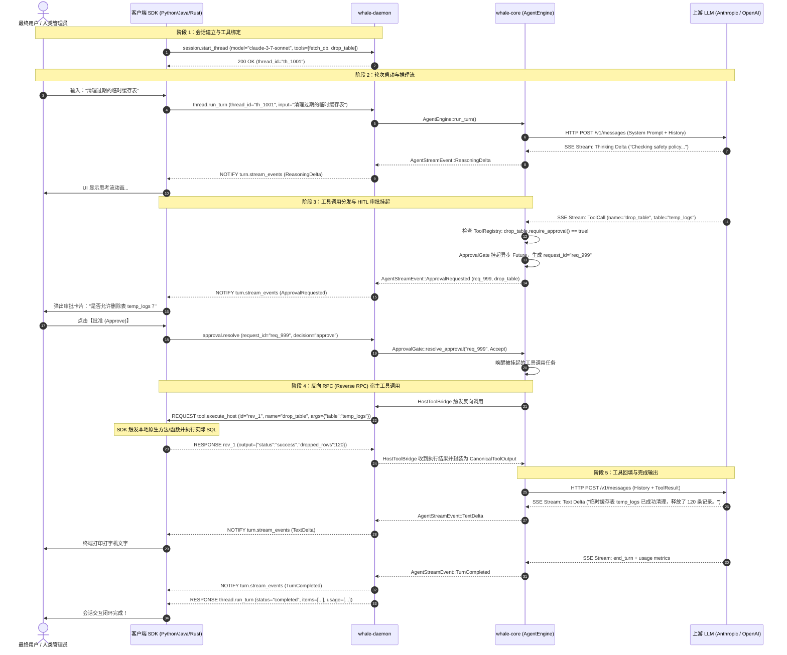

# Whale AI SDK 通信协议规范 (Protocol Specification)

## 1. 协议概览与物理帧格式 (Wire Framing)

Whale AI SDK 的客户端与服务端之间采用标准的 **JSON-RPC 2.0** 规范构建全双工交互通道。

### 1.1 传输物理层与分帧策略
- **传输媒介**: 
  - **标准输入输出 (Stdio IPC)**: 用于客户端以子进程方式拉起 `whale-daemon`。
  - **Unix Domain Socket (UDS)**: 针对本机常驻服务守护进程（如监听 `/tmp/whale.sock`）。
- **帧边界格式 (Framing)**: **按行分隔的 JSON (Newline-delimited JSON / NDJSON)**。
  - 每一个合法的 JSON-RPC 消息（Request、Response 或 Notification）必须被序列化为**单行紧凑 JSON 文本**，并以单个换行符 `\n` (`0x0A`，LF) 结尾。
  - 消息行内部**严禁包含未转义的换行符**；字符串值内部的换行符必须进行标准 JSON 转义（即 `\n`）。
  - 空行或纯空白字符行由读取端自动忽略。

---

## 2. 基础消息信封结构 (Base Envelope Schemas)

严格遵循 [JSON-RPC 2.0 规范](https://www.jsonrpc.org/specification)。

### 2.1 请求信封 (Request Envelope)
由调用方（Client 或进行 Reverse RPC 时的 Daemon）发起：
```json
{
  "jsonrpc": "2.0",
  "id": "req_001_abc",
  "method": "method_name",
  "params": { ... }
}
```
- `jsonrpc`: 必须固定为 `"2.0"`；
- `id`: 请求标识符，可为非空字符串 (`string`) 或整数 (`integer`)；
- `method`: 调用的远程方法名称；
- `params`: 结构化参数对象（`object`）。

### 2.2 响应信封 (Response Envelope)
对请求处理完成后的应答：
```json
{
  "jsonrpc": "2.0",
  "id": "req_001_abc",
  "result": { ... },
  "error": null
}
```
或发生错误时：
```json
{
  "jsonrpc": "2.0",
  "id": "req_001_abc",
  "error": {
    "code": -32602,
    "message": "Invalid parameters",
    "data": { ... }
  }
}
```
**标准错误代码表**:
| 错误代码 (code) | 宏常量 / 含义 | 说明 |
| :--- | :--- | :--- |
| `-32700` | `PARSE_ERROR` | 收到无效 JSON 文本，解析失败 |
| `-32600` | `INVALID_REQUEST` | 发送的 JSON 不是合法的 JSON-RPC 2.0 请求对象 |
| `-32601` | `METHOD_NOT_FOUND` | 请求的方法不存在或未注册 |
| `-32602` | `INVALID_PARAMS` | 方法参数无效、类型不符或缺少必要字段 |
| `-32603` | `INTERNAL_ERROR` | 内部引擎运行时故障或未捕获的系统异常 |

### 2.3 通知信封 (Notification Envelope)
单向单播/广播消息，**严禁包含 `id` 字段**，接收方无需也不得返回响应：
```json
{
  "jsonrpc": "2.0",
  "method": "turn.stream_events",
  "params": { ... }
}
```

---

## 3. Client -> Daemon 方法契约 (Client Requests)

### 3.1 `session.start_thread`
创建或初始化一个独立的对话线程（Thread Session）。

#### 请求参数 (`StartThreadParams`)
| 字段名 | 类型 | 必填 | 说明 |
| :--- | :--- | :--- | :--- |
| `session_id` | `string` | 否 | 自定义线程 ID。若为空，Daemon 自动生成 `th_<uuid>` |
| `provider` | `string` | 否 | 指定后端模型供应商（`"anthropic"` 或 `"openai"`）。若缺省，根据 `model` 名称自动推断 |
| `model` | `string` | 是 | 模型标识符（如 `"claude-3-7-sonnet"`, `"gpt-4o"`, `"o3-mini"`） |
| `system_prompt` | `string` | 否 | 设定给模型的系统提示词指令 |
| `tools` | `RegisterToolDefinition[]` | 否 | 随线程初始挂载的工具定义列表 |
| `metadata` | `object` | 否 | 业务自定义上下文元数据键值对 |

#### 工具定义模型 (`RegisterToolDefinition`)
```json
{
  "name": "calc",
  "description": "Evaluate arithmetic expression",
  "parameters": {
    "type": "object",
    "properties": {
      "expression": { "type": "string" }
    },
    "required": ["expression"]
  },
  "supports_parallel": true,
  "require_approval": false,
  "is_host_tool": true
}
```
- `supports_parallel` (布尔，默认 `true`): 是否允许并发执行（只读工具为 `true`；写文件、改库等排他性工具为 `false`）。
- `require_approval` (布尔，默认 `false`): 执行前是否必须通过 Human-In-The-Loop 审批。
- `is_host_tool` (布尔，默认 `false`): 为 `true` 时由 SDK 宿主环境通过反向 RPC 执行。

#### 响应结果 (`StartThreadResult`)
```json
{
  "jsonrpc": "2.0",
  "id": 1,
  "result": {
    "thread_id": "th_6a20d437-0cfc-40ad-bc14-998877665544",
    "created_at": "2026-09-07T12:00:00Z"
  }
}
```

---

### 3.2 `thread.run_turn`
向指定线程投递新的用户输入，启动单轮 Agent 执行状态机。

#### 请求参数 (`RunTurnParams`)
| 字段名 | 类型 | 必填 | 说明 |
| :--- | :--- | :--- | :--- |
| `thread_id` | `string` | 是 | 目标会话线程的 ID |
| `input_items` | `CanonicalItem[]` | 是 | 本轮输入项数组（通常包含一个 `UserMessage`） |
| `options` | `RunTurnOptions` | 否 | 动态覆盖模型采样参数 |

#### 选项参数 (`RunTurnOptions`)
```json
{
  "model": "claude-3-7-sonnet",
  "temperature": 0.7,
  "max_tokens": 4096,
  "reasoning_effort": "high"
}
```

#### 响应结果 (`RunTurnResult`)
在整轮 Agent 交互彻底收敛结束（或发生致命故障）后同步返回：
```json
{
  "jsonrpc": "2.0",
  "id": 2,
  "result": {
    "turn_id": "turn_c0a80101-1122-3344-5566-778899aabbcc",
    "thread_id": "th_6a20d437-0cfc-40ad-bc14-998877665544",
    "status": "completed",
    "items": [
      {
        "type": "user_message",
        "id": "item_u1",
        "content": [{ "type": "text", "text": "Calculate 15 + 25" }]
      },
      {
        "type": "tool_call",
        "id": "item_t1",
        "call_id": "call_001",
        "name": "calc",
        "arguments": { "expression": "15 + 25" },
        "raw_arguments": "{\"expression\":\"15 + 25\"}"
      },
      {
        "type": "tool_result",
        "id": "item_r1",
        "call_id": "call_001",
        "output": { "type": "text", "text": "40" },
        "is_error": false
      },
      {
        "type": "assistant_message",
        "id": "item_a1",
        "content": [{ "type": "text", "text": "15 + 25 equals 40." }],
        "phase": "final_answer"
      }
    ],
    "usage": {
      "input_tokens": 150,
      "output_tokens": 35,
      "reasoning_tokens": 0,
      "cache_creation_input_tokens": 120,
      "cache_read_input_tokens": 0
    }
  }
}
```

---

### 3.3 `session.register_tools`
在现有会话中动态追加注册新的工具（支持 Host 反向工具）。

#### 请求参数 (`RegisterToolsParams`)
```json
{
  "jsonrpc": "2.0",
  "id": 3,
  "method": "session.register_tools",
  "params": {
    "thread_id": "th_6a20d437-0cfc-40ad-bc14-998877665544",
    "tools": [
      {
        "name": "fetch_user_profile",
        "description": "Fetch user by ID from internal CRM",
        "parameters": {
          "type": "object",
          "properties": { "user_id": { "type": "string" } },
          "required": ["user_id"]
        },
        "supports_parallel": true,
        "require_approval": false,
        "is_host_tool": true
      }
    ]
  }
}
```

#### 响应结果 (`RegisterToolsResult`)
```json
{
  "jsonrpc": "2.0",
  "id": 3,
  "result": {
    "registered_count": 1
  }
}
```

---

### 3.4 `approval.resolve`
人类在环（HITL）审批决策仲裁接口。

#### 请求参数 (`ApprovalResolveParams`)
```json
{
  "jsonrpc": "2.0",
  "id": 4,
  "method": "approval.resolve",
  "params": {
    "request_id": "req_appr_99881122",
    "decision": "approve",
    "feedback": "Approved by security officer"
  }
}
```
- `decision`: `"approve"` 或 `"reject"`；
- `feedback`: 可选的审批批注或驳回原因说明。

#### 响应结果 (`ApprovalResolveResult`)
```json
{
  "jsonrpc": "2.0",
  "id": 4,
  "result": {
    "resolved": true,
    "request_id": "req_appr_99881122"
  }
}
```

---

### 3.5 `tool.execute_host_result`
客户端向 Daemon 汇报宿主本地工具执行结果的显式方法（备选方案，亦可直接作为对 `tool.execute_host` 的标准 JSON-RPC 响应）。

#### 请求参数 (`ToolExecuteHostResult`)
```json
{
  "jsonrpc": "2.0",
  "id": 5,
  "method": "tool.execute_host_result",
  "params": {
    "call_id": "call_001",
    "output": {
      "type": "structured",
      "data": { "status": "success", "rows_affected": 3 }
    },
    "is_error": false
  }
}
```

#### 响应结果
```json
{
  "jsonrpc": "2.0",
  "id": 5,
  "result": {
    "acknowledged": true
  }
}
```

---

## 4. Daemon -> Client 请求与通知规范 (Daemon Pushes)

### 4.1 反向 RPC 请求：`tool.execute_host` (Reverse RPC Request)
当 LLM 决策调用某个标记为 `is_host_tool: true` 的工具时，`whale-daemon` 充当 RPC 客户端，向宿主 SDK 客户端发起远程过程调用。

#### 请求格式
```json
{
  "jsonrpc": "2.0",
  "id": "reverse_call_66778899",
  "method": "tool.execute_host",
  "params": {
    "call_id": "call_001",
    "namespace": null,
    "name": "fetch_user_profile",
    "arguments": {
      "user_id": "usr_9981"
    }
  }
}
```

#### 客户端响应格式 (Client Standard Response)
宿主客户端处理完成后，沿相同 IPC 连接应答：
```json
{
  "jsonrpc": "2.0",
  "id": "reverse_call_66778899",
  "result": {
    "call_id": "call_001",
    "output": {
      "type": "structured",
      "data": {
        "id": "usr_9981",
        "name": "Alice Smith",
        "role": "Platform Engineer"
      }
    },
    "is_error": false
  }
}
```

---

### 4.2 实时流式事件通知：`turn.stream_events` (Notification)
在轮次执行期间，Daemon 持续以单向通知形式将内部事件实时推送至客户端。

#### 通知格式 (`StreamEventsParams`)
```json
{
  "jsonrpc": "2.0",
  "method": "turn.stream_events",
  "params": {
    "turn_id": "turn_c0a80101-1122-3344-5566-778899aabbcc",
    "thread_id": "th_6a20d437-0cfc-40ad-bc14-998877665544",
    "event": { ... }
  }
}
```

#### 事件载荷 `AgentStreamEvent` 变体清单
1. **`turn_started`**:
   ```json
   { "type": "turn_started", "turn_id": "turn_1", "thread_id": "th_1" }
   ```
2. **`item_started`**:
   ```json
   { "type": "item_started", "turn_id": "turn_1", "item_id": "item_1", "item_type": "reasoning", "phase": "commentary" }
   ```
3. **`reasoning_delta`**:
   ```json
   { "type": "reasoning_delta", "turn_id": "turn_1", "item_id": "item_1", "delta": "Analyzing user permissions..." }
   ```
4. **`reasoning_signature`**:
   ```json
   { "type": "reasoning_signature", "turn_id": "turn_1", "item_id": "item_1", "signature": "sig_rsa4096_..." }
   ```
5. **`text_delta`**:
   ```json
   { "type": "text_delta", "turn_id": "turn_1", "item_id": "item_2", "delta": "The calculated total is " }
   ```
6. **`tool_call_delta`**:
   ```json
   { "type": "tool_call_delta", "turn_id": "turn_1", "item_id": "item_3", "call_id": "call_1", "delta": "{\"path\":\"/etc/hosts\"}" }
   ```
7. **`approval_requested`** (触发 HITL 暂停):
   ```json
   {
     "type": "approval_requested",
     "turn_id": "turn_1",
     "request_id": "req_appr_01",
     "tool_call": {
       "type": "tool_call",
       "id": "item_3",
       "call_id": "call_1",
       "name": "delete_table",
       "arguments": { "table_name": "temp_logs" },
       "raw_arguments": "{\"table_name\":\"temp_logs\"}"
     },
     "reason": "Destructive database operation requested"
   }
   ```
8. **`item_completed`**:
   ```json
   { "type": "item_completed", "turn_id": "turn_1", "item": { ... } }
   ```
9. **`turn_completed`**:
   ```json
   {
     "type": "turn_completed",
     "turn_id": "turn_1",
     "thread_id": "th_1",
     "usage": {
       "input_tokens": 200,
       "output_tokens": 40,
       "reasoning_tokens": 15,
       "cache_creation_input_tokens": 0,
       "cache_read_input_tokens": 0
     }
   }
   ```
10. **`turn_failed`**:
    ```json
    { "type": "turn_failed", "turn_id": "turn_1", "thread_id": "th_1", "error_code": "RATE_LIMIT", "error_message": "Provider 429 Too Many Requests" }
    ```

---

## 5. 完整时序交互图：含工具调用与 HITL 审批

以下时序图完整展示了一次复杂的 Agent 交互生命周期：包含会话创建、工具注册、思维链流式吐字、触发高危操作的人工审批拦截、反向 RPC 工具执行、以及最终答案的完成归档。


