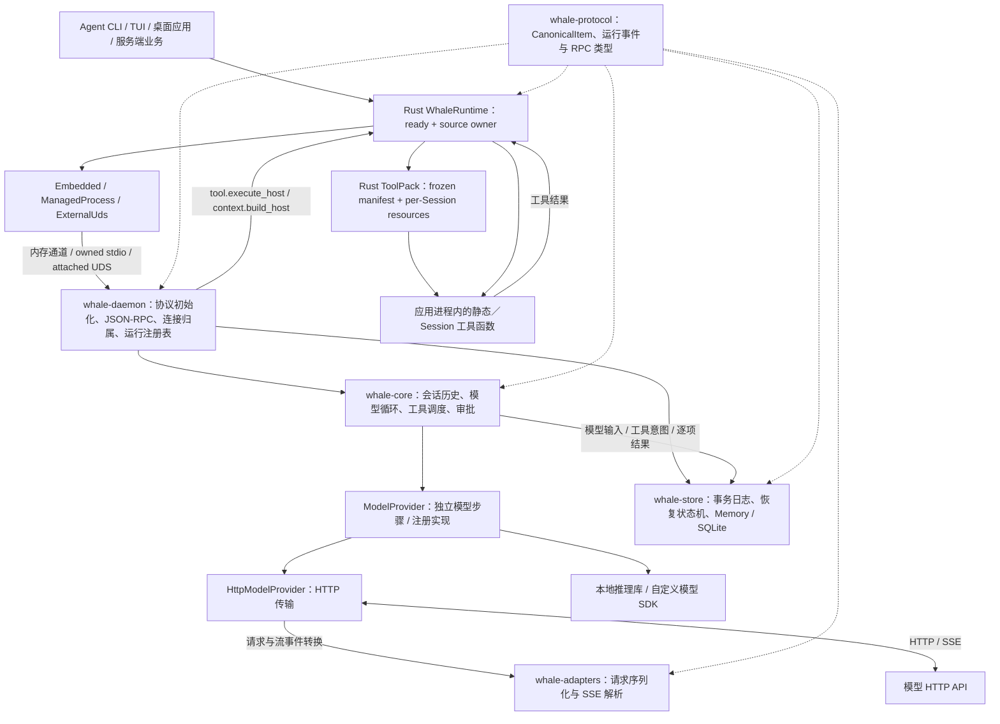

# Whale Agent SDK 架构评估与演进建议

代码状态与外部项目资料均核查至 2026-09-09。原始基线 `ba57cd4`；“本轮实现”指 `feature/agent-sdk-runtime` 工作区，包含运行生命周期 A、Agent/Provider 装配 B1、执行与模型上下文 B2、显式会话关闭 C1、模型执行扩展 C2、连接初始化 C3、持久会话与恢复 C4、自动保留与会话准入 C5、Rust Application Runtime Stage 1、Session View Stage 2.1、Session Management Stage 2.2、通用 Interaction，以及 Rust Session-scoped ToolPack。外部项目使用核查当天实际打开的官方资料，未做性能基准测试。当前工作区包含未提交的改动，不能将其等同于已发布版本。

## 结论

Whale 已有可组合 Agent Runtime 的核心能力：统一消息表示、模型与工具循环、宿主函数反向调用、运行句柄、执行上下文、模型上下文策略、可注册的模型执行接口、可选 SQLite 会话恢复，以及 Rust Application SDK。Stage 1 新增 Rust-only `WhaleRuntime`，让一个应用用默认 embedded、owned managed process 或 attached external UDS 启动同一套执行契约，并在 `open` 返回前完成初始化；Stage 2.1 新增不依赖执行锁的权威 Session 快照、live cursor、有界回放与 Rust 多观察者；Stage 2.2 补上 owner-local Session list、canonical history 分页、metadata CAS、Closing/Closed 回放和 bounded tombstone；通用 Interaction 补上独立 pending snapshot、固定窗口回放、schema 响应、typed approval 共用事务及宿主工具内的安全挂起；Rust ToolPack 则提供每个 live Session 的资源 bind、rollback、callback quiescence、反向 close 和 emergency fence。代码面向 Unix，当前在 macOS 实测；Linux CI 待补，Windows 不支持。这个方向适合让多个 Agent 产品壳（CLI / TUI / GUI / 服务）复用同一 Rust SDK；通用插件发现／依赖／卸载、完整协议生成、凭证抽象、可观测性和匹配 sidecar 分发仍未闭合，不能据此称为工业级、分布式或任意外部 Agent 都可即插即用。

当前交付范围是 **Rust-only Application SDK 基座**。Python / Java 客户端已从仓库移除；跨语言协议契约仍保留在 `whale-protocol`，便于后续按需扩展。历史多语言验收记录仅保存在 [superpowers plans](superpowers/plans/) 作为实现档案。以 pi 的模型／运行时／应用分层为主要参照，借鉴 Codex 的运行生命周期、DeepSeek Harness 的插件装配与释放机制、OpenCode 的协议生成和服务集成方式。CLI、Web UI、业务工具与业务身份留在上层应用。

这里“集成不同 Agent”指开发者用 Whale 定义不同业务 Agent。`RuntimeSource::ManagedProcess` 只能启动实现 Whale 协议并接受 `--listen stdio` 的 Daemon，不能直接包装 Codex、Claude Code、OpenCode、pi 或 DeepSeek Harness CLI。若未来要把这些完整 Agent 作为外部执行后端，需要另设 `AgentBackend` 扩展：它承载完整运行和事件语义，不能伪装成只返回模型 token 的 `ModelProvider`。

## 当前架构与执行路径



一次运行的主要路径：

1. Rust 应用调用 `WhaleRuntime::open`，选择 embedded、managed 或 external UDS；同一个 startup deadline 覆盖 source 创建和协议初始化，成功返回的 `RuntimeInfo` 即为 ready 证据。既有 `WhaleClient` 入口仍在首次普通 RPC 前自动初始化，也可显式检查。
2. SDK 先安装 turn 路由，再发 `thread.start_turn`；Daemon 校验会话归属与忙碌状态，发送接受响应。
3. Engine 将 canonical 输入加入历史，ContextPolicy 为每个模型步骤生成投影；校验内容与能力后，选中的 ModelProvider 执行请求。HTTP 实现使用 Adapter 转换模型协议。
4. 模型产生工具调用时，Coordinator 校验参数、处理审批与并发策略，再校验审批替换参数并记录执行参数，通过反向 RPC 请求对应会话与绑定版本的宿主函数。
5. 工具结果写回历史，再调用模型；模型步骤结束不会直接结束外层运行。
6. Daemon 发布唯一 `finished` 事件和终态快照。应用可以消费事件，也可以独立等待结果、审批、取消或查询快照。

显式持久会话在接受运行前先提交输入，在模型／工具派发前分别提交实际请求与执行意图，每个工具结果独立提交，最后在终态落盘后发布 `finished`。重启只恢复数据；没有结果记录的已派发工具成为 unknown，应用确认后才能开始新回合。新的连接绑定使用新的 live thread ID，原运行快照通过 recovery inspect 读取。

Rust `WhaleRuntime` embedded 和旧 `in_process` 都经过 JSON 序列化与内存消息通道，并非零序列化的直接 Engine 调用。进程边界隔离了语言依赖，不等于权限沙箱；反向工具最终仍以宿主进程权限执行。

| 模块 | 当前职责与源码入口 | 判断 |
| --- | --- | --- |
| `whale-protocol` | [canonical.rs](../crates/whale-protocol/src/canonical.rs)、[rpc.rs](../crates/whale-protocol/src/rpc.rs)、[runs.rs](../crates/whale-protocol/src/runs.rs)、[initialization.rs](../crates/whale-protocol/src/initialization.rs) | 共享契约与协议版本已落地；握手 schema / 共用样本已生成，完整客户端模型生成仍待完成 |
| `whale-adapters` | [traits.rs](../crates/whale-adapters/src/traits.rs)、[openai.rs](../crates/whale-adapters/src/openai.rs)、[responses.rs](../crates/whale-adapters/src/responses.rs)、[anthropic.rs](../crates/whale-adapters/src/anthropic.rs) | 有独立适配接口；三协议的已声明子集已通过本地 HTTP/SSE 验证 |
| `whale-core` | [engine.rs](../crates/whale-core/src/engine.rs)、[model.rs](../crates/whale-core/src/model.rs)、[http_provider.rs](../crates/whale-core/src/http_provider.rs)、[provider.rs](../crates/whale-core/src/provider.rs)、[context.rs](../crates/whale-core/src/context.rs)、[interaction.rs](../crates/whale-core/src/interaction.rs) | 已实现 Agent 循环、模型扩展、上下文策略、通用 Interaction bridge 与 awaited journal 提交；完整插件生命周期仍欠缺 |
| `whale-store` | [lib.rs](../crates/whale-store/src/lib.rs) | 可替换 CAS 后端、所属附件的 FIFO journal、恢复状态机、Memory 与可选 SQLite；不执行模型或工具 |
| `whale-daemon` | [server.rs](../crates/whale-daemon/src/server.rs)、[session_management.rs](../crates/whale-daemon/src/session_management.rs)、[session_catalog.rs](../crates/whale-daemon/src/session_catalog.rs)、[session_history.rs](../crates/whale-daemon/src/session_history.rs)、[interactions.rs](../crates/whale-daemon/src/interactions.rs) | 有双向 RPC、连接归属、统一 V1/V2 publication lane、owner-local catalog/history、Closing/Closed tombstone、Interaction response transaction 和有界维护 |
| Rust Application SDK | [runtime.rs](../crates/whale-sdk-rust/src/runtime.rs)、[connection.rs](../crates/whale-sdk-rust/src/connection.rs)、[session_management.rs](../crates/whale-sdk-rust/src/session_management.rs)、[interactions.rs](../crates/whale-sdk-rust/src/interactions.rs)、[tool_packs.rs](../crates/whale-sdk-rust/src/tool_packs.rs)、[集成指南](RUST_APPLICATION_SDK.md) | 三种 source 共用同一协议路径；ready-before-return、结构化 shutdown、V1/V2/Interaction 独立观察 hub、read-only Session handle、list/history/metadata CAS 与每 Session ToolPack owner 已落地 |

## 已有功能与本轮变化

| 能力 | 原始基线 | 本轮工作区 |
| --- | --- | --- |
| 应用 Runtime | 由各 `WhaleClient` 构造器分别建立连接，构造成功不表示协议 ready | Rust `WhaleRuntime` 统一 embedded、owned managed process 和 attached external UDS；初始化后返回，shutdown 有总预算、single-flight 结果和 mode/phase 错误 |
| 多轮模型／工具循环 | 已实现 HTTP 调用、SSE 消费、工具反馈再请求 | 保留并规范外层运行身份与终态 |
| Canonical IR | 文本、消息、推理、工具调用及结果等结构 | Daemon 接收完整 `input_items`；不再只取第一段用户文本 |
| 模型协议 | OpenAI Chat 与 Anthropic 有请求及流解析；Responses 有请求分支 | 已补 Responses 独立流解析；三协议均经过本地 HTTP/SSE 验证，支持范围见 Agent API |
| 模型执行扩展 | Engine 直接 POST，主要扩展点为 HTTP Adapter | ModelProvider 接收实际投影；启动期工厂注册、provider_ref 选择与能力检查；非 HTTP 工具闭环已验证 |
| 宿主工具 | Rust `HostTool` trait，反向 JSON-RPC | 按会话与不可混用的绑定版本路由；运行中的旧工具不被新注册替换；保留宿主 `is_error` |
| ToolContext | 宿主回调只有工具参数 | Rust 具有执行身份、deadline、合作取消、进度上报与可选 `request_interaction`；完成后作用域关闭并清理挂起请求 |
| 参数校验与审计 | 审批可替换参数，缺少统一 schema 校验 | 注册前验证 schema，执行前与审批修改后校验参数；快照保留原始和实际参数 |
| 模型上下文 | 直接使用会话历史 | 每步可用完整历史、近期完整回合或宿主投影；校验调用／结果配对，原始历史不被替换 |
| 工具调度 | `FuturesOrdered` 保持结果顺序，读写屏障协调执行 | 独占屏障归属工具注册表；`FuturesUnordered` 逐项完成即持久化，最后按原调用顺序回填结果 |
| 审批 | 有挂起、通过、拒绝与参数替换 | 新句柄提供 scoped 审批；快照含待审批；取消清理等待 |
| 运行控制 | 主要是等待最终结果；无公开运行查询／取消 | Rust `RunHandle`，支持 start/result/events/snapshot/cancel |
| Session 观察与管理 | 只有与单次调用绑定的事件消费 | V1 权威 snapshot/watch 保持兼容；V2 增加 owner-local list、独立 history 分页、metadata CAS、Closing/Closed/tombstone、固定 `through` 回放与 typed gap；持久 attach 使用 fresh stream |
| 通用 Interaction | 只有专用工具审批通道 | 可选 `interactions.v1` 提供 Session/Run pending 查询、独立 snapshot/watch/replay、自定义 kind 与 response schema；generic、typed 和 legacy approval 共享 first-commit-wins 仲裁，响应与指纹不进入事件或 Store |
| Session 资源工厂 | 静态宿主工具对象由 Agent 共享，无 per-Session async close owner | Rust ToolPack manifest 在 Agent 构造时冻结；每个 fresh／recovered Session 独立 bind，失败反向 rollback，正常 close 在 callback quiescence 后反向执行；连接 teardown 只有同步 emergency fence |
| 生命周期正确性 | provider 步骤可能产生重复终态，错误可能被当成功；旧 Rust 长流可卡住 | 稳定 turn ID、单一外层终态、失败保留、结果与订阅分离 |
| 通信与退出 | 有 stdio / UDS；关闭与 pending 清理不足 | EOF 清理、RPC 超时处理、完整帧 writer；取消不破坏后续 JSON 帧 |
| 会话资源释放 | 主要依赖连接结束 | Rust 显式 Session close；终态投递后释放运行记录、工具与上下文绑定；其他会话继续使用 |
| 协议兼容 | 无连接初始化 | Rust 自动／显式单次握手，检查版本和所需功能；不兼容时清理连接与所属子进程，在业务派发前失败 |
| 状态存储 | 内存会话历史 | 普通会话继续驻留内存；显式持久会话支持 SQLite、模型输入审计、新身份恢复与 unknown 确认 |
| 保留与容量准入 | 完成记录主要随连接保留 | 可选终态 TTL/数量与 detached Store TTL/数量/字节清理；保留已接受 ID 防止重放；SessionLimits 在派发前检查 |

本轮已实现 Rust Application Runtime、运行原语、AgentDefinition、显式 Provider 配置、ToolContext、ContextPolicy、参数审计、会话资源释放、ModelProvider 注册与能力检查、连接初始化、持久恢复、自动保留、Stage 2.1 Session view/事件回放、Stage 2.2 Session 管理面、通用 Interaction，以及 Rust Session-scoped ToolPack。通用插件发现／依赖／卸载、全协议客户端生成、凭证抽象、匹配 sidecar 分发与跨平台发行仍未完成；Runtime、ToolPack、Interaction 与观察／管理入口见 [Rust Application SDK](RUST_APPLICATION_SDK.md)、[ToolPack API](TOOL_PACK_API.md)、[Interaction API](INTERACTION_API.md) 和 [Session View API](SESSION_VIEW_API.md)，其余公开接口见 [Agent API](AGENT_API.md)、[模型扩展 API](MODEL_PROVIDER_API.md)、[执行上下文 API](EXECUTION_CONTEXT_API.md)、[会话关闭 API](SESSION_API.md)、[连接初始化 API](INITIALIZATION_API.md)、[恢复 API](RECOVERY_API.md) 与 [保留和限额 API](RETENTION_API.md)。

当前有两处依赖边界值得随扩展接口一起调整：

- **应用连接生命周期与 Agent 运行状态分层。** Rust SDK 的非克隆 connection owner 负责 writer、reader、embedded connection loop、managed direct child 或 external socket；Daemon 的 `server.rs` 仍承担 RPC、执行任务、取消和 deadline，C5 的运行注册表维护位于 `retention.rs`。三种 Runtime source 全部进入同一 Daemon 路径，没有复制第二套 Engine 状态机。
- **模型执行边界已抽出。** Adapter 保留 HTTP/SSE 协议职责，HttpModelProvider 负责传输，Engine 统一调用 ModelProvider。注册工厂可使用本地推理库或其他模型 SDK；Rust 通过 provider_ref 选择 Daemon 中的注册引用。当前是启动期注册，尚无动态卸载或跨进程宿主模型回调流协议。

## 与同类 Agent 基座的对比

| 项目 | 主要架构与集成方式 | Whale 值得采用的部分 | 对 Whale 的取舍 |
| --- | --- | --- | --- |
| **pi** | `pi-ai` 模型层、`pi-agent-core` 运行层、`pi-coding-agent` 应用层；可嵌入 Agent，提供上下文转换和工具执行钩子 | 运行内核不依赖终端 UI；应用历史与模型输入分开；provider 与 context 可注入 | Whale 已形成 `WhaleRuntime -> Agent -> WhaleThread -> RunHandle`，但 embedded 仍走 Daemon 协议，不是直接嵌入 Agent Core；coding-agent 的 ResourceLoader、skills 和工作目录仍属于产品层。[官方仓库](https://github.com/earendil-works/pi)、[Agent Core](https://github.com/earendil-works/pi/blob/main/packages/agent/README.md) |
| **Codex** | coding agent 通过 app-server 暴露 thread / turn / item、审批、通知和中断；有初始化与 schema 生成 | 稳定运行身份、接受／执行／终态分离、查询恢复、协议版本与能力协商 | Whale 已实现 ready handshake 和应用连接 owner，但没有 Codex 的匹配 runtime 发行、鉴权、workspace、sandbox 或 coding workflow；完整 Codex 接入属于未来 AgentBackend。[官方 app-server 文档](https://learn.chatgpt.com/docs/app-server) |
| **DeepSeek Harness** | 基于 Cordis，模型、工具、会话日志和循环均由插件提供；profile / bundle 组合运行形态 | 插件注册需要归属、依赖和卸载清理；配置可组合；SDK 与 UI 使用同一运行底座 | Whale 已用 focused Rust ToolPack 实现 per-Session manifest freeze、bind/rollback、normal reverse close 与 emergency fence，但没有 Harness 的通用插件发现、依赖、profile 或热卸载；Runtime shutdown 也不等价于 awaited ToolPack close。项目仍标注 developer preview。[架构](https://github.com/deepseek-ai/deepseek-harness/blob/master/docs/architecture.md)、[项目状态](https://github.com/deepseek-ai/deepseek-harness) |
| **OpenCode** | 当前稳定入口是 Headless HTTP server、OpenAPI 3.1 生成客户端与 SSE，SDK 可创建 server + client 或只连接已有服务；V2 SDK beta 另提供 `OpenCode.create()`，由应用内组装 server、通过内存 router 调用并由宿主显式 close | 协议作为 SDK 类型来源；owned 与 attached 入口分开；V2 beta 进一步强化应用宿主显式持有和释放运行底座 | Whale 的 ManagedProcess / ExternalUds 已区分 owned 与 attached，但 embedded 仍经过 JSON 序列化、内存 transport 和 Daemon，并非 OpenCode V2 的应用内 router；OpenCode V2 尚为 beta，Whale 也仍未实现 OpenAPI 生成客户端和产品插件环境。[Server](https://opencode.ai/docs/server/)、[SDK](https://opencode.ai/docs/sdk/)、[V2 SDK beta](https://opencode.ai/v2/docs/build/sdk) |
| **Claude Agent SDK** | 将 Claude Code 的 agent loop、内置工具、会话、审批、hooks、subagents、skills 和 MCP 作为 Python / TypeScript 库提供，并随 SDK 携带匹配的原生 Claude Code runtime | 明确区分 Agent SDK、CLI、底层模型 Client SDK 与托管 Agent；产品界面复用同一循环，宿主通过权限、预算、hooks 和事件控制运行 | Whale 的产品边界与它最接近，但目标是 Rust-first、provider-neutral，并把 Whale Daemon 的 embedded / owned / attached 生命周期公开给宿主；文件系统、Shell、coding persona 和 CLI 呈现不应成为通用内核默认项。[概览](https://code.claude.com/docs/en/agent-sdk/overview)、[Agent loop](https://code.claude.com/docs/en/agent-sdk/agent-loop) |

这些是架构适配判断，不是能力评分或性能排名。Whale 的差异化机会在于：开发者用 Rust 和现有业务对象提供工具，一套 Runtime 负责一致的运行与连接语义，上层产品自由选择 CLI、桌面或服务端交互。

集成入口还应区分产品与内核。Codex 现有 TypeScript 和 Python SDK，Python 提供同步/异步入口及匹配 CLI runtime；app-server 面向更深的交互式产品集成。Claude Agent SDK 同样把 CLI 使用场景和可嵌入的 loop 库分开。OpenCode 除 HTTP/SSE 外还有 ACP stdio。pi 除 Agent Core 外还提供完整 coding AgentSession SDK 与 `pi --mode rpc`。这些完整 Agent 的历史、权限和工具执行仍由其自身拥有，Whale 接入时应适配其控制协议。`RuntimeSource` 只选择 Whale Daemon 的部署与传输方式，不是这些产品的兼容层。[Codex SDK](https://learn.chatgpt.com/docs/codex-sdk)、[Claude Agent SDK](https://code.claude.com/docs/en/agent-sdk/overview)、[OpenCode ACP](https://opencode.ai/docs/acp/)、[pi coding SDK](https://raw.githubusercontent.com/earendil-works/pi/main/packages/coding-agent/docs/sdk.md)、[pi RPC](https://raw.githubusercontent.com/earendil-works/pi/main/packages/coding-agent/docs/rpc.md)

DeepSeek Harness 已将完整外部 Agent 放在 `ctx.subagents`，与 `ctx.llm` 分开，支持能力预检、start/result/dispose；移除注册也不会替持有人撤销已返回的运行。这是 Whale 将 AgentBackend 与 ModelProvider 分开的直接参照。该边界应保留后端的运行身份、取消、工具所有权和能力限制，防止两层循环重复执行同一工具。[subagent 契约](https://raw.githubusercontent.com/deepseek-ai/deepseek-harness/master/docs/subsystems/subagent.md)。本次完整复核记录见 [上游架构快照](superpowers/plans/architecture-upstream-snapshot.md)。

具体复用时也要保留语义差异：pi 当前 Agent Core 会依次等待订阅回调，Whale 的慢消费者契约则要求订阅与结果独立，不能原样搬用事件派发实现。DeepSeek Harness 的 SDK bundle 通过启动 profile 和 stdio RPC 接入，插件机制本身不代表进程内嵌入或权限沙箱。Codex 的动态工具反向调用和 WebSocket 接口仍标为 experimental；应借鉴其契约设计，具体接入时核验版本与能力。[pi Agent Core](https://raw.githubusercontent.com/earendil-works/pi/main/packages/agent/README.md)、[DeepSeek SDK bundle](https://raw.githubusercontent.com/deepseek-ai/deepseek-harness/master/packages/bundle/sdk-app/README.md)、[Codex app-server](https://learn.chatgpt.com/docs/app-server)。

pi 的 Agent Core 与 coding-agent SDK 也要分开看：后者的资源发现、工作目录、skills 与会话文件属于 coding 应用层。DeepSeek 默认 sdk profile 带 coding persona 和文件工具，最小组合使用单独的 sdk-minimal profile；可配置不代表默认没有产品预设。[pi coding SDK](https://raw.githubusercontent.com/earendil-works/pi/main/packages/coding-agent/docs/sdk.md)、[DeepSeek SDK bundle](https://raw.githubusercontent.com/deepseek-ai/deepseek-harness/master/packages/bundle/sdk-app/README.md)。

DeepSeek Harness 的架构还要求模型可见输入能从日志重建。Whale C4 已针对这一点持久化每步 ContextPolicy 投影后的 `ModelRequest`，包括 system prompt、items、工具定义、采样配置和步骤身份。恢复可检查派发前保存的实际投影请求；记录存在本身不证明 Provider 已接收，也不保证随机模型再次调用会返回相同输出。[DeepSeek 架构](https://raw.githubusercontent.com/deepseek-ai/deepseek-harness/master/docs/architecture.md)。

## 距离“即插即用”还缺什么

### 模型与工具：已落地部分及剩余工作

1. **Provider 配置与注册引用已贯通。** Rust 可显式选择三种协议、base URL 和环境凭证引用，也可通过 provider_ref 选择已注册实现；使用显式 ProviderConfig 时，无认证必须显式声明。未知引用、冲突配置、非法 URL 与缺失显式凭证在创建会话前拒绝；旧配置路径保留原有的可选凭证行为。连接握手已检查 Daemon 所需功能，模型能力另由 provider.inspect 描述；动态插件卸载仍待实现。
2. **Responses 已补齐已声明子集。** 新解析器处理文本、函数调用、推理摘要与密文续传、usage 和终态；截断与失败不再变成空成功。文本/图片输入与工具结果经过边界测试；audio、refusal、provider 原生工具等当前明确报错，不能宣称支持全部上游 API。实际 HTTP/SSE 测试检查第二步请求的工具调用 ID 与业务结果。
3. **ToolContext、参数校验与 Rust Session 资源工厂已贯通。** Rust 宿主函数可获取 Agent / Session / Turn / call ID、deadline、取消信号及进度。初始与审批修改后的参数均校验 JSON Schema，并记录原始与实际参数。Rust ToolPack 为每个 live Session 绑定独立业务资源并负责 rollback/close；静态工具仍由宿主对象持有。这项 focused 能力不包含通用授权策略、插件发现、依赖解析或热重载。
4. **ModelProvider 与能力边界已落地。** 请求拥有投影后的上下文、工具定义、采样选项及独立步骤身份；不暴露原 ThreadSession。Rust 已通过注册非 HTTP Provider 完成两步工具循环。能力验证按位置拒绝不支持的内容，并验证推理与采样选项；thinking budget／prompt caching 已实际贯通，单次覆盖后恢复默认值。HTTP 描述标记为协议子集，不代表探测过任意远端型号。

自定义模型必须显式结束步骤。空流、截断、重复调用 ID、未完成工具／推理条目、用户消息或伪造工具结果都不能产生工具执行。取消涵盖建流和消费流，错误路径也释放调用作用域；共享 Provider 不共享会话取消状态。插件热替换、模型目录发现、远程模型能力探测和跨进程宿主模型回调仍需独立扩展。

当前能力描述仍有表达限制：Engine 会把同一组输入能力检查用于已完成的模型输出，因此暂时不能表达“模型可以生成推理，但下一步不接受推理历史”。ContextPolicy 不能绕过前一步的输出检查；增量事件也不等于已通过校验的完整输出。未来扩展模型种类时应明确区分输入支持范围与输出合同，见 [ModelProvider API](MODEL_PROVIDER_API.md)。

### 建立面向应用的组合接口

目标对象职责如下。`WhaleRuntime`、AgentDefinition、Agent、WhaleThread、RunHandle、V1 Session View/回放、V2 Session list/history/metadata/lifecycle、Interaction、ToolContext、Rust ToolPack、ContextPolicy、启动期 ProviderRegistry 与 SessionStore 已有公开 API；CredentialResolver 与完整插件系统仍属于后续设计：

```text
WhaleRuntime（三种 source、ready、连接 owner）
  ├── WhaleClient -> AgentDefinition -> Agent
  │     ├── ToolPack factories + frozen manifests
  │     ├── ContextPolicy（构造模型上下文）
  │     └── Session（独立历史 + fresh bound resources）
  │           └── RunHandle（事件、结果、快照、Interaction、审批、取消）
  └── RuntimeSource -> DaemonServer
        ├── ProviderRegistry（启动期模型步骤实现）
        └── StoreRuntime / SessionStore（已提交历史与状态）
```

`AgentDefinition` 作为可复用配置，不携带共享可变历史。静态宿主函数通过绑定引用注入并按 Agent 共享；ToolPack 工厂与 frozen manifest 也由 Agent 共享，但每个 live Session 的 `BoundToolPack`、handler 和 binding ID 都重新创建。Callable 与 bound 资源不能序列化进配置或模型输入；持久 attach 的 bind context 只得到 recovery ID，不得到 secret、revision、history 或 Provider credential。

`ContextPolicy` 已从完整会话历史生成每一步模型输入，允许宿主实现业务检索、裁剪和压缩，并验证工具调用与结果配对。持久会话已记录实际投影。目前每步仍复制完整历史，内置近期回合策略没有 token 预算、增量摘要状态或分层加载；Store 每次 CAS 写入完整记录，长会话的存储与复制成本还需要后续优化。

当前 ToolPack 只覆盖 Session-scoped `HostTool` 资源，适合包装数据库、Shell worker 或 MCP client；它已经提供声明顺序 bind、反向 rollback/close 与连接断开时的 emergency fence。Provider、ContextPolicy 和 Store 维持独立 owner。未来通用插件层若要覆盖发现、依赖、注册和热卸载，需要另行定义可释放句柄与失败回滚，不能把当前 ToolPack 或 MCP 工具来源扩展直接解释成完整 Agent 生命周期接口。

建议的通用插件层应位于这些 typed registry 之上，负责装配而不重新实现 Agent loop。最小契约包括：稳定的 plugin ID／版本／SDK API 范围；声明 `provides`、`requires` 与可选依赖；Runtime、Agent、Session 三种作用域；安装后返回拥有所有注册项的可释放 handle；安装失败按反向顺序 rollback；Session／Run 在创建时冻结所见 generation，运行中替换不会改变既有绑定；关闭按依赖逆序 await dispose，异常断连只执行预先声明的同步 fence。Provider、HostTool／ToolPack、ContextPolicy、Store、hook／telemetry sink 继续使用各自的强类型 trait，插件描述符只组合它们，避免形成一个同时处理模型、工具、存储和完整外部 Agent 的 mega-trait。

第一阶段可以只实现显式代码注册和依赖拓扑，不急于做动态库扫描或市场。验收应包含重复 ID／版本范围／依赖环拒绝、部分安装回滚、同一插件多 Session 隔离、旧 generation 继续完成、卸载等待 callback quiescence，以及一个插件失败不破坏其他 Agent。配置文件发现、签名包、动态库 ABI 和远程市场属于独立的分发与信任问题，应在稳定进程内契约后再设计。

### 长期使用与发行

- **显式释放、自动保留和准入预算已落地。** C5 的周期维护在无新 RPC 时仍运行，只清理成功投递终态的运行、已脱离且无 unknown 的持久记录。Rust 释放完成路由的强引用，用户已持有的结果和事件仍可读；后续查询明确返回 RunExpired。SessionLimits 约束已接受运行数、canonical 历史字节和实际 ModelRequest 字节，不是 token 预算或硬内存上限；单次大输出仍会保留，随后阻止继续派发。未关闭长会话、调用者引用及轻量身份墓碑仍可累计。[保留和限额 API](RETENTION_API.md)
- **持久化与恢复已落地。** 应用预先保存 RecoveryKey，再显式创建持久会话；重启后检查、重新绑定并恢复历史。SQLite 使用本机文件和独占进程锁；写入失败使 journal 拒绝后续写入，需重新打开 Store 恢复。unknown 确认只记录业务处理决定，不代表工具成功、停止或得到补偿。当前没有分布式租约、自动补偿或服务端工作恢复。
- **Session 管理面已落地。** Daemon 按 transport owner 隔离 Open／Closing／Closed records，固定窗口 list/history cursor 经过 owner-bound HMAC 验证；Rust read-only handle 与 write-capable `WhaleThread` 分离。metadata 以 V2 view revision 做 CAS，持久写入先于可见事件；V2 subscriber 可回放 Closed 后终止，tombstone 与 cursor 都有硬容量和 TTL。该目录不是 detached Store 的全局检索接口，持久 reattach 会建立 fresh thread/stream。
- **基础协议兼容已落地。** 首次普通 RPC 前自动完成 protocol.initialize，也可显式检查；版本与所需功能不匹配时关闭连接，并在所属子进程退出后返回兼容错误。仓库提供 24 个握手响应样本，已生成握手 schema；全协议客户端模型生成及发行版本矩阵仍待完成。握手确认协议支持，不代表模型支持、身份认证或工具授权。
- **安装与进程管理。** Rust embedded 已提供无需独立 binary 的源码入口，managed 也能启动调用者给定的 Whale-compatible executable。六个 crate 已补齐 source-package 元数据、包内 README/LICENSE、内部依赖版本与拓扑打包校验；仓库外 consumer 会同时针对 workspace 与解包后的依赖图编译。匹配 sidecar 的发现／下载／打包、Linux CI 与更多目标平台仍需后续工作；安装 SDK 不会自动获得 Daemon binary。
- **类型与依赖体验。** Rust SDK 当前依赖 core 与 daemon，公开 embedded source 也暴露 `DaemonServer`；可考虑通过 feature 分离 attached 轻客户端和嵌入模式，并验证独立制品的依赖解析。
- **可观测性。** 提供结构化运行／模型／工具 span、usage 与错误标签，并让应用选择日志和遥测出口。

## 推荐实施顺序与验收

| 阶段 | 交付物 | 验收重点 |
| --- | --- | --- |
| R：Rust Application Runtime Stage 1 | embedded、owned managed process、attached external UDS；owner/capability 分离；ready-before-return；结构化 bounded shutdown | 普通 Rust `cargo test` 覆盖初始化门、失败 rollback、Drop、连接隔离、direct-child reap 和 single-flight；无 CLI/TUI/Desktop 实现 |
| A：可靠运行契约（已落地） | Rust `RunHandle`、唯一终态、取消／审批／快照、作用域、帧与关闭处理 | 同一 Daemon 实现通过长流、工具多步、取消、EOF、并发与慢消费者测试；真实 stdio 已纳入 |
| B：可组合业务 Agent（B1、B2 已落地） | AgentDefinition、Provider 配置、ToolContext、ContextPolicy、参数校验、执行审计与绑定版本 | 两个不同业务 Agent 无需修改内核；Rust library consumer 只使用公开 API；C2 已补模型输入能力检查 |
| C：可持续集成与发行（C1–C5 已落地） | 会话关闭、模型扩展、协议初始化、持久恢复与自动保留；后续为通用插件生命周期和版本化发行 | Rust 组合、无自动重放的进程重启恢复、真实空闲过期与准入已验证；通用插件发现／依赖／热卸载和新环境安装仍需实现与验收 |
| T：Rust Session ToolPack（已落地） | frozen manifest、fresh/recovered Session bind、Preparing gate、反向 rollback/close、callback quiescence、emergency fence | 普通 Rust 测试验证 per-Session identity、取消／失败／panic、single-flight close、persistent attach 与 dynamic-name 边界；无 wire 或 Daemon 变更 |
| S：Session Management Stage 2.2（已落地） | owner-local list、canonical history page、metadata CAS、V2 lifecycle replay、read-only handle、bounded tombstone | protocol/Store/daemon/SDK focused tests及真实 embedded persistent recovery；V1 JSON/签名与 close 行为回归保持不变 |
| I：通用 Interaction（已落地） | 私有 opt-in、pending snapshot、固定窗口 replay/watch、schema response、typed approval 共事务、嵌套宿主请求 | 等价响应只交付一次；冲突／非法响应不消费；取消、deadline、origin finish、Session close、EOF 与 publication failure 清理；响应和指纹不持久化 |
| P：Rust source-package hardening（已落地） | 六个 crate 的版本化内部依赖、包内文档／许可证、解包编译与仓库外 consumer | 默认与声明 MSRV 工具链分别运行 verifier；sidecar binary 分发仍不在当前 source-package 闭包内 |

当前 Rust host 可只使用公开 API 完成 embedded `WhaleRuntime -> AgentDefinition + ToolPack -> WhaleThread -> RunHandle -> Session close -> Runtime shutdown`，也可通过 `WhaleClient::list_sessions -> SessionViewHandle::{snapshot,history_page,watch}` 观察 owner namespace，用 `WhaleThread::replace_metadata` 做 CAS，并在 opt-in Session 上查询／订阅／响应 Interaction。Compile-checked 示例明确先 await Session close 获得 normal pack cleanup，再关闭 Runtime；managed 与 external source 仍遵守相同 ready 和 connection ownership 契约。该验收是库调用与确定性 fixture，不需要实现产品 CLI、TUI 或 Desktop。

下一步应优先设计统一插件描述／依赖／作用域／可逆注册，补凭证解析、完整协议 schema/client generation、可观测性、sidecar 分发和 Linux CI。只有产品范围扩大到托管完整外部 Agent runtime 时，再单独设计 AgentBackend。[Interaction 计划](superpowers/plans/2026-09-09-interaction.md)记录通用交互的事务与安全边界，[Session management 计划](superpowers/plans/2026-09-09-session-management.md)记录 Stage 2.2 的协议、Store、daemon、SDK 与兼容性证据，[ToolPack 计划](superpowers/plans/2026-09-09-tool-pack.md)记录 Rust Session 资源生命周期证据，[Session View 计划](superpowers/plans/2026-09-09-session-view-replay.md)记录 Stage 2.1 的契约与验证边界，[Rust Application Runtime 计划](superpowers/plans/2026-09-09-rust-app-runtime.md)记录 Stage 1 生命周期证据，[Rust package 计划](superpowers/plans/2026-09-09-rust-release-hardening.md)要求从解包后的 crate 和仓库外消费者验证交付闭包；[C4 设计与验收](superpowers/plans/2026-09-08-session-store.md)记录持久化故障边界，[C5 设计与验收](superpowers/plans/2026-09-08-retention.md)记录保留与准入边界。

## 验证范围

当前验收入口：

```sh
cargo test --workspace
cargo run -q -p whale-protocol --example initialization_contract -- --check
cargo build -p whale-daemon --bins --examples
./scripts/verify_rust_packages.sh
```

默认 workspace 覆盖协议契约、Core 循环、Store、Daemon 与 SDK 路径。少量 `#[ignore]` 的真实进程或外部 HTTP fixture 测试用于专项验收，不在默认套件中执行。`protocol_peer_fixture.py` 与 `fixtures/protocol/` 提供确定性不兼容 stdio peer 与握手响应样本。

历史多语言验收数字（含已删除的 Python/Java SDK 与 `verify_*.py` 联调脚本）仅保存在 [superpowers plans](superpowers/plans/) 中作为实现档案，不代表当前交付范围。Stage 1 的最终命令、通过数和 ignored 审计以 [Stage 1 verification ledger](superpowers/plans/2026-09-09-rust-app-runtime.md#verification-ledger) 为准。

stdio fixture 只替换模型输出，使用真实 SDK、子进程管道、Daemon、Engine、审批、Interaction 和反向工具 RPC。HTTP/SSE 测试使用正式 Daemon 和本地模型服务，检查实际请求中的工具 ID、业务结果、投影内容和模型配置。原生模型 fixture 通过公开 Registry 注册，检查严格流终态、工具执行前校验以及建流／消费流时取消。测试覆盖声明的协议子集，没有使用付费模型。完整插件系统、全协议客户端生成、凭证服务、可观测性和跨平台 binary 发行仍属于后续工作。

审查另发现并修复过若干边界：Rust 无人持有的 attachment 在后台 close 被拒绝时关闭连接；Core 五类 usage 累计溢出返回明确失败；Daemon 保留竞态（延迟登记不能误删替换运行、无 Store clone 不能覆盖维护目标）；查询租约语义覆盖失败/取消与真实事件先于查询响应；已接受取消被 Core 取消错误覆盖为普通失败的竞态。连接初始化通过公共契约测试与共享握手样本验证；`initialization_contract -- --check` 可独立复核样本与 schema。
