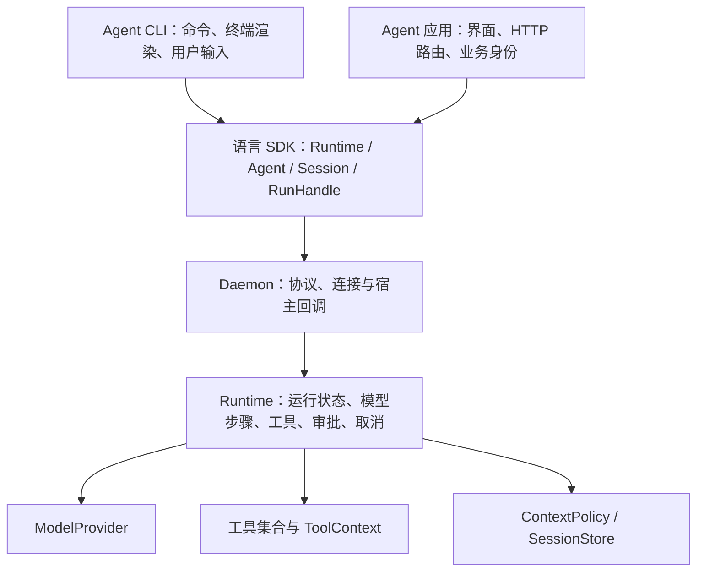

# Whale：面向 Agent CLI 与应用的 SDK 设计草案

状态：目标设计。阶段 A 的运行生命周期、阶段 B1 的 AgentDefinition 与 Provider 配置、阶段 B2 的 ToolContext、ContextPolicy、参数校验、执行审计和工具绑定版本、阶段 C1 的显式会话关闭、阶段 C2 的 ModelProvider、启动注册与能力检查，以及阶段 C3 的连接初始化与协议兼容检查已在工作区实现。各阶段契约、真实 stdio 和本地 HTTP/SSE 验证记录见对应实施计划。自动保留策略、持久 Store／恢复、插件生命周期、原生异步入口、可观测性、完整 schema 客户端生成及匹配发行安装仍待实现。下文接口名和验收要求仍包含未来设计，当前能力与测试边界以 [架构评估](../../SDK_ARCHITECTURE_REVIEW.md)、[Agent API](../../AGENT_API.md)、[模型扩展 API](../../MODEL_PROVIDER_API.md)、[运行 API](../../RUN_API.md)、[执行上下文 API](../../EXECUTION_CONTEXT_API.md)、[会话关闭 API](../../SESSION_API.md) 和 [初始化 API](../../INITIALIZATION_API.md) 为准。

依据：用户明确目标是让后续多个 Agent CLI 或 Agent 应用基于 Whale SDK 开发；源码基线为 `ba57cd4`，核查日期为 2026-09-08。

## 1. 产品定位与成功标准

Whale 为开发者提供可组合、与界面无关的 Agent 运行能力。开发者选择模型，定义指令、业务工具和运行策略，再用同一组 SDK 接口构建终端 CLI、桌面应用或服务端 Agent 应用。

这里的“多个 Agent”首先指多个独立 Agent 产品和业务配置可以复用同一套底座。每个产品都应能独立启动、运行、取消和关闭自己的任务；多 Agent 自动委派与协作属于可在这些原语之上构建的扩展。

产品验收应证明：两个不同业务 Agent 能在不修改 Whale 内核的情况下创建；CLI 与应用后台能消费相同运行契约；不同会话的工具、事件和配置互不串用。声明了多语言支持的能力必须通过对应 SDK 验证。

## 2. 推荐架构与取舍

| 方案 | 优点 | 代价与适用范围 |
| --- | --- | --- |
| Rust Runtime + 多语言 SDK + 本地 Daemon（推荐） | 复用当前实现，各语言共享一套执行行为，工具继续留在业务进程 | 需要可靠的双向协议、进程管理和版本兼容 |
| 各语言各自实现运行循环 | 原生调试和依赖体验直接 | 模型、重试、事件、审批容易出现多份不一致实现 |
| 将所有应用统一接到远程 Agent 服务 | 服务部署与横向扩容集中管理 | CLI 离线启动、宿主内存工具和本地使用增加网络依赖 |

保留第一种方案。Rust 的直接内核嵌入与 Daemon 服务入口必须服从同一运行契约。已有 Rust SDK 的 `in_process` 仍经过 JSON 序列化和内存消息通道，应按真实实现描述其成本。



SDK 和内核不得直接打印业务输出、读取终端确认或绑定 Web 框架。Daemon 的协议输出与诊断日志分别使用 stdout 与 stderr。

## 3. SDK 与应用的职责

| SDK / Runtime 负责 | CLI / 应用负责 |
| --- | --- |
| 会话、运行句柄、状态与稳定 ID | 命令名称、页面、路由与交互布局 |
| 模型请求、工具循环和 usage | 业务指令、工具实现和允许使用的模型 |
| 事件流、最终结果、错误与取消 | 将事件渲染为终端输出、聊天消息或 SSE |
| 审批请求的挂起、决议和生命周期 | 谁能审批、如何展示，以及用户身份认证 |
| 工具绑定作用域、schema 校验、执行上下文 | 调用现有服务、数据库、文件或其他业务系统 |
| 存储接口、上下文构建接口 | 选择存储位置、保留策略、检索来源和业务记忆 |
| 自己启动的 Daemon 的启动、检查与关闭 | 应用进程的部署与整体生命周期 |

内核保持业务中立。文件编辑、Shell、浏览器、数据库连接等可以形成可选工具包；安装核心 SDK 本身不自动授予这些能力。工具审批表示执行授权，进程分离本身不构成操作系统沙箱。

## 4. 最小公开对象

| 对象 | 职责与建议语义 |
| --- | --- |
| `Runtime` | 配置 provider、管理连接与运行注册表；创建 Agent、查询运行、关闭自身资源 |
| `AgentDefinition` | 不可变的指令、模型引用、工具定义、上下文策略与运行限制；创建多个独立 Session |
| `Session` | 某个 Agent 实例的一段有序会话；`start_turn(input, options)` 接受完整 canonical 输入并返回 RunHandle |
| `RunHandle` | 本次 turn 的运行句柄；独立提供 `events`、`result`、`cancel`、`snapshot`、`resolve_approval` |
| `ToolContext` | 应用作用域、Agent / Session / Run / tool-call ID、取消信号、deadline 与进度上报入口 |
| `ModelProvider` | 接受模型请求并返回模型步骤事件；认证、HTTP/SSE 或其他调用方式在实现内部处理 |
| `ContextPolicy` | 从会话记录构建模型上下文，支持业务检索、裁剪与压缩 |
| `SessionStore` | 存取已经提交的会话记录与运行状态；可选择内存实现或持久化实现 |

`RunHandle` 是一次 turn 的执行对象，不另引入与 turn 并列的工作流实体。线路层可以继续使用 `turn_id`；SDK 的 `run.id` 就是该 `turn_id`，避免双重 ID。

AgentDefinition 保存可记录的配置与引用，宿主函数、数据库对象和凭证解析器通过 Runtime 另行绑定；这些宿主对象不序列化为模型输入。每次运行的 generation overrides、步数限制和 deadline 只作用于当前运行，不悄悄修改 Session 默认配置。

以下是目标交互顺序，属于接口设计说明，不是当前可执行示例：

```text
runtime = 打开 Runtime(provider 配置)
agent = runtime 注册 AgentDefinition(指令、模型、工具、运行策略)
session = agent 创建会话()
run = session.start_turn(用户输入)          # 接受后返回，不等待模型完成
订阅 run.events                          # 渲染增量、工具进度、审批
run.resolve_approval(审批 ID, 决议)        # 可由其他 UI 回调调用
run.cancel()                             # 可由 Ctrl+C 或停止按钮调用
result = 等待 run.result                  # 与事件订阅独立
```

语言接口可以符合本地习惯，但语义一致：Rust 提供异步句柄；Python 提供异步接口与同步包装；Java 提供句柄和 CompletionStage／事件订阅。用户回调在独立调度环境执行，不占用协议读取线程。

首轮完善已有 Rust、Python、Java SDK。TypeScript 可以沿用稳定协议新增；在真实消费者选择 TypeScript 时单独安排，不以多做一个客户端替代现有契约验证。

## 5. 运行契约

### 5.1 状态、事件和结果

运行状态为 `running`、`waiting_approval`、`cancelling`，终态为 `completed`、`failed`、`cancelled`。审批等待不是终态。输入或配置校验失败发生在运行接受之前，直接返回结构化错误，不伪造已启动任务。

一次已接受的运行只提交一个终态事件。每个事件包含 Session ID、Turn ID、该运行内递增的序号；工具事件还包含 tool-call ID。模型步骤事件包含 step ID，但不能创建新的外层 Turn ID，也不能结束外层运行。

启动接口接受可选的 client request key，在当前 Runtime 内按 Session 作用域去重：相同 key 和相同输入返回同一个运行，不再次调用模型；相同 key 配不同输入返回冲突。在加入持久 Store 之前，不承诺跨进程重启去重。

最终结果包含终态、完整已提交 items、usage、可用的错误或取消原因、最终事件序号。事件流和最终结果表达相同结论：模型流失败不能被转成成功，工具失败必须保留失败标记。

任务启动响应需要早于该任务的事件发送；启动响应写出后再激活运行事件。最终结果可以从终态事件或查询接口获取，SDK 不得在收到另一路 RPC 结果后提前删掉尚未处理的事件。

### 5.2 订阅与背压

事件消费、等待结果、审批回复和取消彼此独立。只等待最终结果的应用不需要创建一个永远无人消费的有界事件队列。

协议读取循环只能解析、分发和更新运行状态，不能等待业务事件队列或执行用户回调。为慢订阅者设置明确的有界缓冲：缓冲耗尽时结束该订阅并报告 `EventLagged`，运行继续，调用方通过快照取得状态与完整已提交内容。不得静默漏事件或阻塞整条连接。首轮不承诺逐 token 的断线重放。

`Runtime.get_run(id)` 在 Runtime 存活、所属 Session 尚未关闭期间返回句柄；快照包含状态、已提交 items、待审批请求、usage、最后事件序号和终态结果。应用可以在 HTTP/SSE 连接关闭后重新查询运行，UI 连接的结束不自动等于任务取消。应用显式关闭 Session 后释放其内存运行记录与去重键，之后查询返回 `RunNotFound`，重开会话使用新的 Session ID。

### 5.3 会话与工具作用域

每个 Session 同时最多有一个活动运行，第二个启动请求明确返回 `SessionBusy`。CLI 或应用可以在自身层排队。多个 Session 可以并发。

AgentDefinition 是可重复使用的配置，不携带共享可变会话历史。Session 记录其使用的配置版本；配置更新显式应用于后续会话或空闲会话，不在工具运行途中暗中修改。

宿主工具以绑定 ID 加 Session 作用域路由，模型看到的工具名称与回调绑定 ID 分开。两个 Agent 都可以定义 `search`，不能因名称相同覆盖对方。对相同外部资源的互斥使用显式资源键；不让所有 Session 共用一把默认全局独占锁。

### 5.4 审批、取消与关闭

审批状态必须能从快照读取，应用不应因漏看单次事件而永远失去审批入口。决议为接受、拒绝或修改参数；修改后的参数重新做 schema 和策略校验，同时保留原始与实际执行参数。

审批与取消请求校验连接作用域及所属运行。重复提交相同审批决议可以返回已处理状态，冲突决议返回明确错误。待审批运行被取消时，必须清理审批等待和后续工具派发。

取消先确认请求已接收，再通过最终状态确认逻辑运行结束。Runtime 停止后续模型和工具派发，向已经执行的工具传递取消信号。对于不能强制中断的宿主函数，记录执行结果仍未确认，不声称外部副作用已经停止；晚到结果不得重新打开终态运行。

`Runtime.close()` 取消自己拥有的活动运行、清理 pending RPC 和订阅，并回收自己启动的 Daemon。连接现有 Daemon 的客户端只关闭自己的连接与资源。拥有宿主工具的 SDK 连接断开时，该连接所属的活动运行应中断并清理；这不同于应用前端的 SSE 连接断开。

### 5.5 模型配置、上下文与恢复

Provider 配置显式表达 provider 类型、模型、endpoint、认证引用和支持的能力；未知 provider、不可用认证和不支持的输入类型在请求执行前返回清楚错误。模型选项从三个语言 SDK 到 Adapter 必须贯通。SDK 不要求所有模型支持相同的推理或多模态能力。

原始会话记录与发送给模型的上下文分开。上下文压缩不能静默破坏原始审计记录；工具调用与结果的关联在构建上下文时保持完整。

第一阶段用内存 Store，明确查询与恢复只在当前 Runtime 存活期间有效。持久 Store 阶段保存已提交记录、配置引用和状态；重启后遇到未完成的工具调用时标记执行结果未知，要求业务处理，不自动重放可能产生副作用的工具。恢复宿主工具绑定由应用重新注册；缺少绑定必须报错。

## 6. 两类产品的验收场景

### 6.1 终端数据分析 Agent CLI

CLI 用 Python SDK 定义数据分析指令、查询与统计工具；SDK 运行模型循环。终端逐步显示文字、工具进度和审批，Ctrl+C 通过运行句柄取消；完成后可以继续同一会话。

验收：工具循环后最终回复仍可见；1000 条增量事件在持续消费时不丢失、不死锁；读取审批只依赖公开 API；取消只影响当前运行；运行后的同一会话仍可处理新输入。测试使用本地可控模型服务，不依赖付费密钥。

### 6.2 运维 Agent 应用后台

应用用 Java SDK 注入现有服务对象作为工具。启动请求返回运行 ID，界面通过应用自己的 SSE 路由消费事件；审批由独立业务接口提交；应用服务进程持有 Runtime，前端断线后可以重新查询快照。两个用户会话使用各自绑定的同名工具。

验收：回调中发起审批不会阻塞协议 reader；断开前端 SSE 后仍能查询运行；两会话的事件与工具实现不串用；慢订阅者不拖住其他会话；调用方只等待结果也可完成任务。应用身份认证和前端路由由示例应用实现，SDK 只提供有作用域的运行原语。

## 7. 当前实现到目标设计的迁移

| 阶段 | 工作与当前文件落点 | 完成证据 |
| --- | --- | --- |
| A：运行契约 | `whale-protocol` 拆模型步骤／运行事件；`whale-core` 统一终态、错误、取消；`whale-daemon` 管理活动运行与事件顺序；三个 SDK 引入 RunHandle | 真实 stdio + 本地 HTTP/SSE fixture，覆盖长流、工具多步循环、审批、取消、断连、慢消费者、同会话竞争和跨会话隔离 |
| B：应用组合接口 | 增加 AgentDefinition、Provider 配置、ToolContext、运行快照与上下文策略；补完整 canonical 输入和模型能力校验 | 两类产品示例使用公开 SDK 完成流程；新增业务 Agent 不需要编辑 Rust 内核 |
| C：持续使用与发行 | 增加持久 Store、恢复语义、协议握手及兼容协商、二进制发现／安装／关闭；按消费者需要加入工具包、MCP 或新语言 SDK | 选择持久 Store 时通过重启恢复测试；干净安装环境能启动示例；版本不兼容时明确报错 |

先保留现有 crate 分层，按职责拆分大模块；仅在依赖边界需要独立发布时增加 crate。Daemon 依赖 Runtime，Runtime 不依赖 SDK；业务工具通过 trait 或宿主回调注入。

现有 `run_turn` 接口可以作为兼容包装保留，但内部必须复用同一 RunHandle。线协议破坏性调整应声明版本，不能让旧客户端把新终态当成模型步骤结束。新的异步启动与最终结果通道需要单独契约测试。

## 8. 原始基线的源码依据

- [`whale-core/src/session.rs`](../../../crates/whale-core/src/session.rs)：当前会话拥有 history、adapter、registry 和采样选项。
- [`whale-core/src/coordinator.rs`](../../../crates/whale-core/src/coordinator.rs)：当前工具执行只有 JSON 参数；registry 按工具名查找；coordinator 持有全局读写屏障。
- [`whale-protocol/src/rpc.rs`](../../../crates/whale-protocol/src/rpc.rs)：当前包含 start thread、run turn、工具注册与审批方法，没有运行查询或取消。
- [`whale-daemon/src/server.rs`](../../../crates/whale-daemon/src/server.rs)：当前 run turn 等待完整结果，独立转发事件，并只提取输入中的第一段用户文本。
- [`whale-sdk-rust/src/lib.rs`](../../../crates/whale-sdk-rust/src/lib.rs)：当前在等待 turn RPC 完成后返回事件接收器，订阅按 thread ID 保存。
- [`Python thread.py`](../../../sdks/python/src/whale_ai_sdk/thread.py)：当前后台线程运行请求，EventStream 消费队列。
- [`Java AgentThread.java`](../../../sdks/java/src/main/java/com/whale/ai/AgentThread.java)：当前异步入口返回最终结果的 CompletableFuture，事件通过独立 consumer 处理。

以上源码描述对应原始基线 `ba57cd4`。工作区已修复该基线中的运行生命周期问题，并提供 AgentDefinition 与显式 Provider 配置。阶段 A 使用可控模型输出做真实 stdio 联调；阶段 B1 增加正式 Daemon 与本地 HTTP/SSE 服务的三语言模型／宿主工具闭环验证；阶段 B2 已验证 ToolContext、上下文策略、参数校验、执行审计与版本化工具绑定；阶段 C1 增加单会话关闭、资源释放及关闭与注册／回调的竞态处理；阶段 C2 已验证三语言选择注册非 HTTP 模型、真实上下文与工具回填、输入能力边界及模型流取消。阶段 C3 已实现三语言共享的自动／显式初始化：协商协议版本 1 和全部八项能力，业务请求及宿主回调须在就绪后执行；格式错误或不兼容的 peer 会使客户端关闭连接，并在返回失败前回收其拥有的子进程。最终 C3 验证（含已接受取消的竞态修复）为 Rust workspace 232 通过、10 忽略，公共验收 4 项／4 次 HTTP，以及八种失败模式 × 每语言两项 × 三语言共 48 个失败子进程验收通过；early EOF 可发送零次初始化，其余模式一次，均不发送业务请求。契约和记录见 [C3 计划](../plans/2026-09-08-protocol-initialization.md) 与 [初始化 API](../../INITIALIZATION_API.md)。持久 Store／恢复、自动保留策略、插件生命周期、原生异步入口、可观测性、完整 schema 客户端生成和匹配发行安装仍未完成，完整目标保持进行中。
